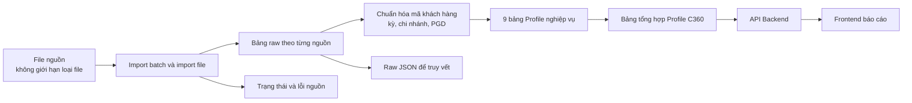
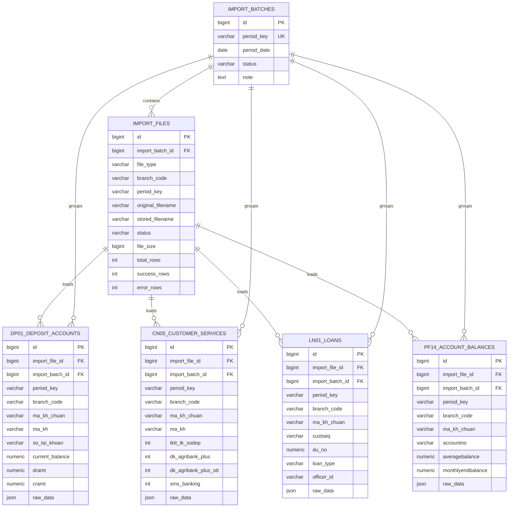
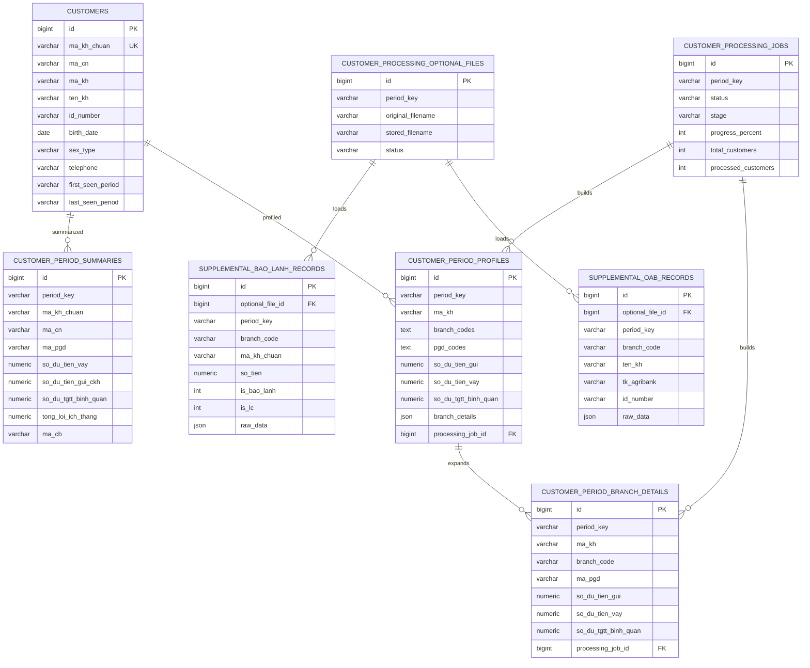
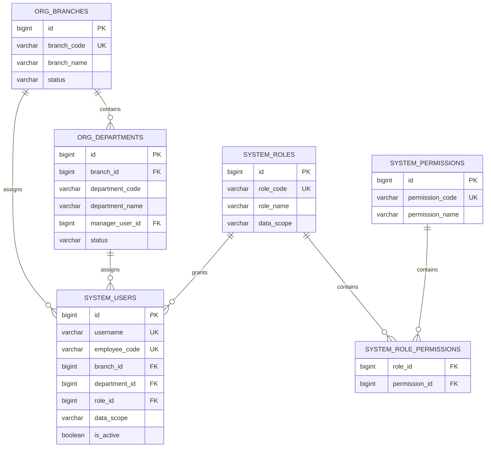
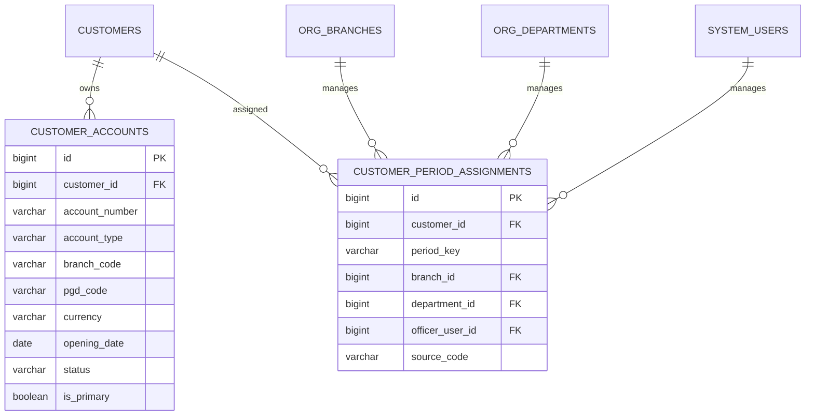
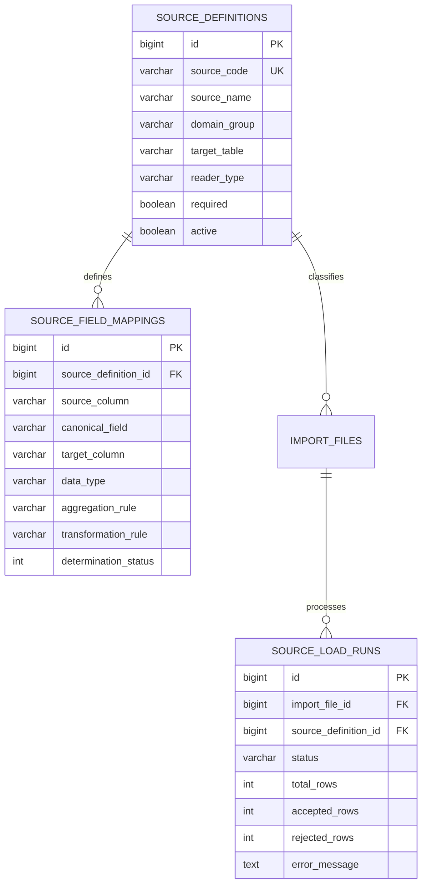

# ERD kho dữ liệu và Profile khách hàng C360

## 1. Mục tiêu tài liệu

Tài liệu này mô tả:

- Các bảng đang tồn tại trong dự án `QUANLYKHACHHANG`.
- Luồng từ file nguồn đến bảng raw, bảng xử lý và báo cáo.
- Thiết kế dự kiến cho Profile khách hàng theo 9 nhóm nghiệp vụ trong file `Profile khach hang.xlsx`.
- Cách mở rộng khi xuất hiện thêm loại file hoặc trường dữ liệu mới.

Đây là tài liệu thiết kế. Các bảng ở phần **Dự kiến** chưa được tạo trong database và có thể tiếp tục điều chỉnh trước khi viết Alembic migration.

## 2. Nguyên tắc thiết kế

1. File nguồn có thể tăng theo thời gian; không giới hạn ở DP01, CN05, LN01 và PF14.
2. Mỗi file import phải truy được kỳ dữ liệu, chi nhánh, tên file và trạng thái xử lý.
3. Bảng raw giữ dữ liệu gần với nguồn; bảng nghiệp vụ giữ dữ liệu đã chuẩn hóa.
4. Dữ liệu định danh ổn định tách khỏi số liệu biến động theo kỳ.
5. Không đồng nhất `NULL` với `0`:
   - `NULL`: chưa có hoặc chưa xác định được dữ liệu.
   - `0`/`FALSE`: đã xác định và giá trị thực sự bằng 0/không sử dụng.
6. Mọi chỉ tiêu tổng hợp cần lưu dấu vết nguồn (`source_file_id`, `source_code`) khi khả thi.
7. Khách hàng có thể xuất hiện ở nhiều chi nhánh/PGD; không mặc định một khách hàng chỉ thuộc một đơn vị.

## 3. Kiến trúc dữ liệu tổng thể



## 4. ERD các bảng hiện tại

### 4.1. Nhập dữ liệu và bảng nguồn



### 4.2. Xử lý và tổng hợp khách hàng hiện tại



Các bảng hỗ trợ khác:

- `report_source_statuses`: trạng thái nguồn theo kỳ.
- `customer_period_exchange_rates`: tỷ giá theo kỳ.
- `audit_logs`: lịch sử thao tác.

### 4.3. Tổ chức, người dùng và phân quyền hiện tại



## 5. ERD 9 nhóm Profile khách hàng dự kiến

`CUSTOMERS` là hồ sơ gốc. Tám bảng còn lại lưu ảnh chụp nghiệp vụ theo kỳ. Tổng cộng là 9 nhóm theo các cột trong Excel.

```mermaid
erDiagram
    CUSTOMERS ||--o{ CUSTOMER_PERIOD_DEPOSITS : has
    CUSTOMERS ||--o{ CUSTOMER_PERIOD_LOANS : has
    CUSTOMERS ||--o{ CUSTOMER_PERIOD_INTERNATIONAL_BUSINESS : has
    CUSTOMERS ||--o{ CUSTOMER_PERIOD_FEES : generates
    CUSTOMERS ||--o{ CUSTOMER_PERIOD_DIGITAL_SERVICES : uses
    CUSTOMERS ||--o{ CUSTOMER_PERIOD_CARD_SERVICES : uses
    CUSTOMERS ||--o{ CUSTOMER_PERIOD_BILL_PAYMENTS : uses
    CUSTOMERS ||--o{ CUSTOMER_PERIOD_ABIC_SERVICES : uses

    CUSTOMERS {
        bigint id PK
        varchar ma_kh_chuan UK
        varchar ma_kh
        varchar ten_kh
        varchar ten_chu_dn
        varchar cccd
        varchar ma_so_thue
        date ngay_sinh
        date ngay_thanh_lap
        varchar gioi_tinh
        varchar dia_chi
        varchar dien_thoai
        varchar loai_khach_hang
        varchar phan_loai_khach_hang
        varchar nghe_nghiep
    }

    CUSTOMER_PERIOD_DEPOSITS {
        bigint id PK
        bigint customer_id FK
        varchar period_key
        varchar branch_code
        varchar pgd_code
        date ngay_giao_dich_gan_nhat
        numeric so_du_tktt
        numeric so_du_tktt_binh_quan
        numeric doanh_so_tktt
        numeric so_du_tgckh
        numeric so_du_tgckh_binh_quan
        numeric ftp_nguon_von
    }

    CUSTOMER_PERIOD_LOANS {
        bigint id PK
        bigint customer_id FK
        varchar period_key
        varchar branch_code
        numeric du_no_ngan_han
        numeric du_no_ngan_han_bq
        numeric du_no_trung_dai_han
        numeric du_no_trung_dai_han_bq
        numeric du_no_thau_chi
        numeric du_no_xau
        numeric du_no_xlrr
        numeric dprr_thang
        numeric dprr_luy_ke
        numeric ftp_du_no
    }

    CUSTOMER_PERIOD_INTERNATIONAL_BUSINESS {
        bigint id PK
        bigint customer_id FK
        varchar period_key
        varchar branch_code
        numeric doanh_so_ttqt
        numeric doanh_so_lc
        boolean kieu_hoi
        boolean ttqt
    }

    CUSTOMER_PERIOD_FEES {
        bigint id PK
        bigint customer_id FK
        varchar period_key
        varchar branch_code
        numeric phi_bao_lanh
        numeric phi_chuyen_tien
        numeric phi_kdnt
        numeric phi_ttqt
        numeric phi_lc
        numeric phi_nhdt
        numeric phi_the
        numeric phi_pos
        numeric phi_khac
        numeric tong_phi
    }

    CUSTOMER_PERIOD_DIGITAL_SERVICES {
        bigint id PK
        bigint customer_id FK
        varchar period_key
        varchar branch_code
        boolean tk_so_dep
        boolean agribank_plus
        boolean ott
        boolean ebanking
        boolean sms_nhac_no_vay
        boolean sms_tien_gui
        boolean loa_than_tai
        boolean hkd_tai_khoan
        boolean hkd_etax
    }

    CUSTOMER_PERIOD_CARD_SERVICES {
        bigint id PK
        bigint customer_id FK
        varchar period_key
        varchar branch_code
        boolean the_ghi_no_noi_dia
        boolean the_loc_viet
        boolean the_ghi_no_quoc_te
        boolean the_tin_dung_quoc_te
        boolean tra_luong_ca_nhan
        boolean tra_luong_phap_nhan
        boolean pos
        numeric doanh_so_pos
    }

    CUSTOMER_PERIOD_BILL_PAYMENTS {
        bigint id PK
        bigint customer_id FK
        varchar period_key
        varchar branch_code
        boolean thu_ho_tien_dien
        boolean thu_ho_tien_nuoc
        boolean thu_ho_vien_thong
        boolean thu_ho_hoc_phi
        boolean thu_ho_vien_phi
    }

    CUSTOMER_PERIOD_ABIC_SERVICES {
        bigint id PK
        bigint customer_id FK
        varchar period_key
        varchar branch_code
        boolean bao_an_tin_dung
        boolean bao_an_tai_khoan
        boolean bao_an_chu_the
        boolean bao_hiem_tai_san
        boolean bao_hiem_chay_no
        boolean bao_hiem_xe_may
        boolean bao_hiem_o_to
        boolean bao_hiem_nha_o
        boolean bao_hiem_suc_khoe
    }
```



### 5.1. Khóa và chỉ mục đề xuất

Các bảng theo kỳ nên có:

```sql
UNIQUE (period_key, customer_id, branch_code)
```

Chỉ mục tối thiểu:

```text
(period_key)
(customer_id)
(branch_code, period_key)
(customer_id, period_key)
```

Nếu một chỉ tiêu cần chi tiết tới PGD thì thêm `pgd_code` vào khóa duy nhất. Quyết định này phải dựa trên cấp dữ liệu thực tế của từng nguồn.

## 6. Bảng hỗ trợ tài khoản và phân công

Hai bảng này không tính vào 9 nhóm Excel nhưng cần để tránh thiết kế `TKTT1`, `TKTT2`, `TKTT3` và để lưu lịch sử cán bộ:



## 7. Thiết kế để bổ sung không giới hạn file nguồn

Các file mới không nhất thiết phải làm tăng số cột trong `import_files`. Nên bổ sung lớp cấu hình nguồn:



Khi có file mới:

1. Thêm một bản ghi vào `source_definitions`.
2. Khai báo ánh xạ cột trong `source_field_mappings`.
3. Tạo bảng raw riêng nếu cấu trúc nguồn cần lưu lâu dài; nếu chưa ổn định có thể giữ `raw_data JSON`.
4. Viết bộ đọc/chuẩn hóa cho nguồn.
5. Ánh xạ kết quả vào một hoặc nhiều bảng Profile.
6. Bổ sung kiểm tra chất lượng và trạng thái nguồn.

Không nên đưa mọi file bổ sung vào cùng một bảng raw khổng lồ vì kiểu dữ liệu và cấp dữ liệu của chúng khác nhau.

## 8. Quan hệ giữa bảng hiện tại và bảng dự kiến

| Bảng hiện tại | Vai trò tương lai |
|---|---|
| `customers` | Tiếp tục là hồ sơ khách hàng gốc, mở rộng thêm trường CIF |
| `dp01_deposit_accounts` | Nguồn raw cho tiền gửi và danh sách tài khoản |
| `pf14_account_balances` | Nguồn raw cho số dư cuối kỳ/bình quân |
| `ln01_loans` | Nguồn raw cho nhóm tiền vay |
| `cn05_customer_services` | Nguồn raw cho NHĐT và thẻ |
| `supplemental_bao_lanh_records` | Nguồn bổ sung cho bảo lãnh/LC |
| `supplemental_oab_records` | Nguồn bổ sung cho Loa thần tài/OAB |
| `customer_period_profiles` | Có thể trở thành bảng tổng hợp đọc nhanh cho giao diện |
| `customer_period_branch_details` | Tổng hợp theo khách hàng, kỳ và đơn vị |
| `customer_period_summaries` | Cần đánh giá hợp nhất với `customer_period_profiles` để tránh trùng |
| `report_source_statuses` | Tiếp tục theo dõi độ đầy đủ của từng nguồn |

## 9. Các quyết định cần chốt trước khi tạo migration

1. Khóa nghiệp vụ chuẩn là `ma_kh_chuan` hay khóa nội bộ `customer_id`.
2. Mỗi bảng Profile tổng hợp ở cấp tỉnh, chi nhánh hay PGD.
3. Trường nào được phép lấy giá trị gần nhất và trường nào bắt buộc đúng kỳ.
4. Quy tắc cộng số liệu khi khách hàng xuất hiện ở nhiều chi nhánh.
5. Nguồn ưu tiên khi nhiều file cùng cung cấp một trường.
6. Cách biểu diễn “không dùng sản phẩm” và “chưa có dữ liệu”.
7. Có hợp nhất `customer_period_summaries` và `customer_period_profiles` hay không.
8. Những trường trạng thái nguồn 2–5 trong Excel chỉ tạo nullable hay chờ xác định xong.

## 10. Lộ trình triển khai đề xuất

### Giai đoạn 1

- Chốt mapping 84 trường trong Excel.
- Chuẩn hóa tên trường và cấp dữ liệu.
- Xác định nguồn ưu tiên và quy tắc `NULL`.

### Giai đoạn 2

- Tạo các bảng hỗ trợ nguồn.
- Mở rộng `customers`.
- Tạo 8 bảng nghiệp vụ theo kỳ.
- Tạo Alembic migration theo từng nhóm nhỏ.

### Giai đoạn 3

- Viết ETL từ các bảng raw hiện tại.
- Chỉ xử lý trước các trường trạng thái nguồn `1`.
- Đối soát tổng số khách hàng và tổng số dư với báo cáo hiện hành.

### Giai đoạn 4

- Mở rộng file nguồn mới theo cấu hình.
- Bổ sung API Profile C360.
- Chia giao diện thành các tab tương ứng 9 nhóm.

## 11. Trạng thái tài liệu

- Phiên bản: `Draft 1`.
- Chưa tạo bảng mới.
- Chưa thay đổi API hoặc giao diện.
- Có thể cập nhật dần khi nguồn file và yêu cầu nghiệp vụ được bổ sung.
