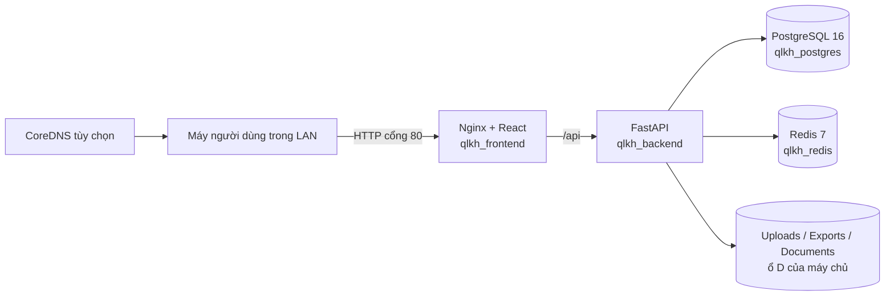
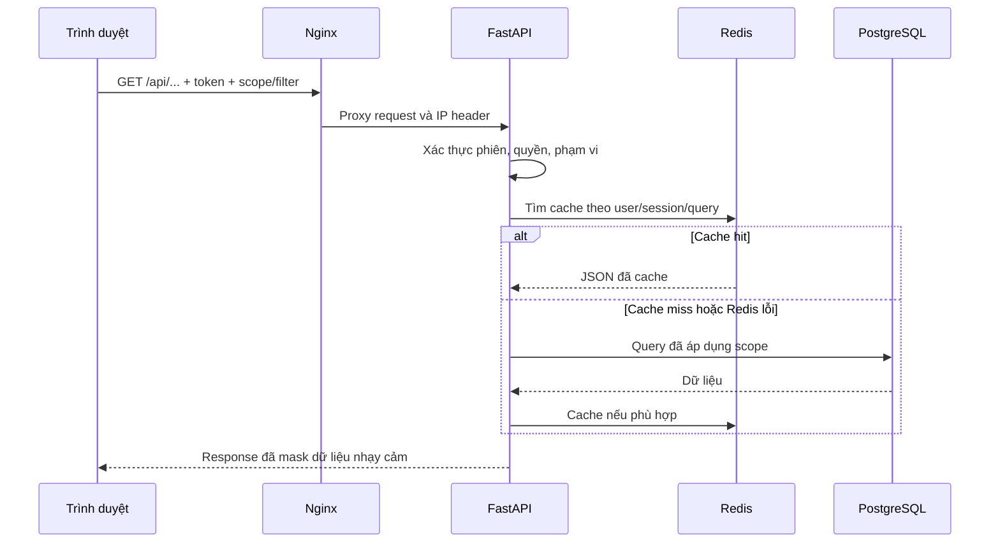
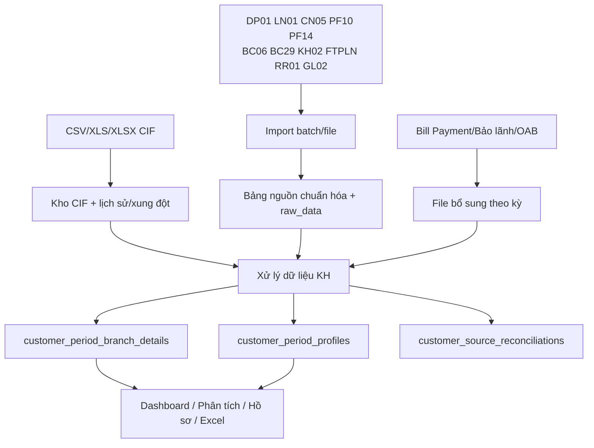
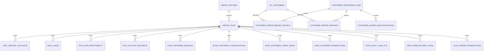
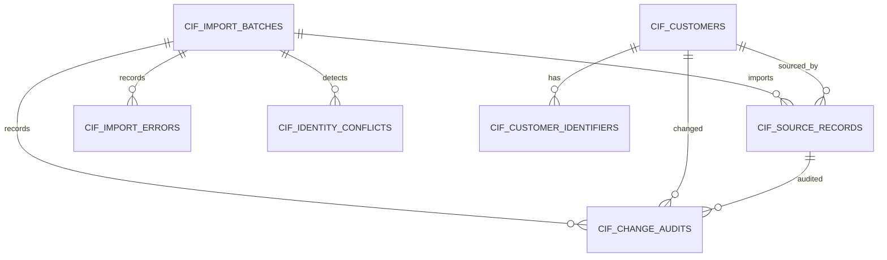
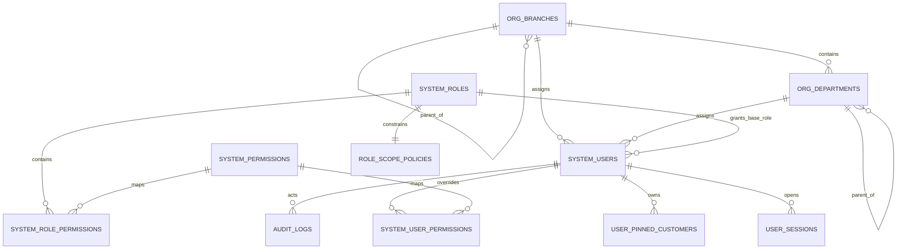

# KIẾN TRÚC HỆ THỐNG VÀ ERD C360

- **Mã tài liệu:** C360-ARC-10
- **Phiên bản:** 1.0
- **Ngày cập nhật:** 21/09/2026
- **Đối tượng:** Phát triển, quản trị hệ thống, quản trị dữ liệu và đơn vị nghiệm thu kỹ thuật

## 1. Mục tiêu kiến trúc

C360 được thiết kế để:

- Chạy độc lập trong mạng LAN không có Internet sau khi đã chuẩn bị image.
- Hợp nhất khách hàng theo mã KH lõi từ Kho CIF.
- Lưu nguồn theo kỳ, xử lý ra chi tiết KH–chi nhánh và hồ sơ KH tổng hợp.
- Áp dụng quyền chức năng, phạm vi dữ liệu và quyền trường nhạy cảm tại backend.
- Phục vụ Dashboard, phân tích, hồ sơ KH và xuất Excel mà vẫn truy vết được nguồn.
- Có thể mở rộng thêm nguồn mà không thay đổi ý nghĩa các bảng nguồn hiện có.

## 2. Công nghệ

| Lớp | Công nghệ |
|---|---|
| Frontend | React 19, Vite, Ant Design, Axios |
| Web/proxy | Nginx trong container frontend |
| Backend | Python 3.12, FastAPI, SQLAlchemy, Polars/openpyxl/xlrd |
| Database | PostgreSQL 16 |
| Cache | Redis 7, cache không bền vững |
| Migration | Alembic |
| Đóng gói | Docker Compose |
| CI/CD | GitHub Actions, GHCR và self-hosted runner khi có Internet |
| Mạng nội bộ | IP tĩnh, DNS CoreDNS tùy chọn, firewall Windows |

## 3. Sơ đồ triển khai

Frontend chỉ công khai cổng 80. Nginx giữ nguyên prefix `/api` khi proxy tới `backend:8000`. Cổng backend trực tiếp nên bind `127.0.0.1` hoặc không public ở production; PostgreSQL 5432 chỉ mở khi có nhu cầu quản trị và được firewall giới hạn.

## 4. Luồng request

Redis là lớp tăng tốc không phải nguồn dữ liệu. Redis lỗi phải fallback PostgreSQL và không làm thay đổi kết quả nghiệp vụ.

## 5. Luồng dữ liệu nghiệp vụ

### Grain chính

| Lớp | Grain |
|---|---|
| CIF source | Một dòng nguồn CIF |
| CIF identifier | Một mã CIF đầy đủ tại một chi nhánh |
| CIF customer | Một mã KH lõi |
| Bảng nguồn | Theo grain nguyên bản: tài khoản, khoản vay, giao dịch hoặc KH |
| Branch detail | Một kỳ + KH lõi + chi nhánh + PGD |
| Period profile | Một kỳ + KH lõi |
| Reconciliation | Một job + nguồn + chi nhánh + KH lõi + lý do |

## 6. Phân lớp dữ liệu

### 6.1. Metadata import

- `import_batches`: một lần người dùng gửi nhóm file nguồn.
- `import_files`: từng file, loại nguồn, kỳ, chi nhánh, trạng thái, thời gian và lỗi.
- `cif_import_batches`: job import CIF và tiến độ.
- `customer_processing_optional_files`: file bổ sung gắn kỳ.

### 6.2. Kho CIF

- `cif_customers`: golden customer theo mã lõi.
- `cif_customer_identifiers`: mã CIF đầy đủ theo chi nhánh.
- `cif_source_records`: bản ghi nguồn/lịch sử phục vụ đối chiếu.
- `cif_import_errors`: lỗi/cảnh báo từng dòng.
- `cif_identity_conflicts`: xung đột CCCD/mã số thuế hoặc bản ghi thay đổi.
- `cif_change_audits`: lịch sử người xác nhận/ghi đè.
- `cif_golden_rules`: quy tắc chọn bản ghi chuẩn.

### 6.3. Bảng nguồn theo kỳ

| Nguồn | Bảng |
|---|---|
| DP01 | `dp01_deposit_accounts` |
| LN01 | `ln01_loans` |
| CN05 | `cn05_customer_services` |
| PF10 | `pf10_loan_profitability` |
| PF14 | `pf14_account_balances` |
| BC06 | `bc06_customer_classifications` |
| BC29 | `bc29_customer_credit_risks` |
| KH02 | `kh02_customer_transactions` |
| FTPLN | `ftpln_daily_loan_ftp` |
| RR01 | `rr01_handled_risk_loans` |
| GL02 | `gl02_ledger_transactions` |

Các bảng lưu khóa import, kỳ, chi nhánh, mã KH chuẩn hóa, các cột nghiệp vụ dùng thường xuyên và `raw_data` để truy vết.

### 6.4. Bảng bổ sung/cấu hình

- `supplemental_bao_lanh_records`, `supplemental_oab_records`, `supplemental_billpayment_transactions`.
- `business_matching_rules`: mã dịch vụ/điều kiện ghép có thể thay đổi.
- `system_configuration_entries`: cấu hình nghiệp vụ có quản trị.
- `customer_period_exchange_rates`: tỷ giá chuẩn theo kỳ và CCY.

### 6.5. Bảng kết quả xử lý

- `customer_processing_jobs`: trạng thái, tiến độ, báo cáo chất lượng và thời gian.
- `customer_period_branch_details`: số liệu tại từng quan hệ chi nhánh/PGD.
- `customer_period_profiles`: hồ sơ tổng hợp toàn bộ quan hệ theo kỳ.
- `customer_source_reconciliations`: nguồn không khớp CIF và lý do.
- `customer_period_summaries`: bảng tổng hợp cũ/khả năng tương thích; không nên phát triển thêm nếu profile mới đã đáp ứng.

### 6.6. Profile domain mở rộng

- `customer_branch_relationships`: quan hệ KH–chi nhánh và nơi giao dịch chính.
- `customer_representatives`: người đại diện/chủ doanh nghiệp.
- `customer_deposit_period_metrics`: chỉ tiêu tiền gửi theo kỳ.
- `customer_loan_period_metrics`: chỉ tiêu tiền vay theo kỳ.
- `customer_revenue_period_metrics`, `customer_fee_period_metrics`: thu nhập/phí.
- `product_definitions`, `customer_product_period_statuses`: danh mục và trạng thái sản phẩm.
- `profile_metric_definitions`, `profile_metric_rule_versions`: từ điển chỉ tiêu và phiên bản công thức.

Các bảng domain cho phép mở rộng 9 nhóm hồ sơ mà không tạo một bảng cực rộng mới cho mỗi file nguồn.

## 7. ERD lõi nhập và xử lý

## 8. ERD Kho CIF

`cif_customers.customer_core_code` là khóa tự nhiên nghiệp vụ; khóa số `id` dùng liên kết nội bộ. `cif_customer_identifiers.full_cif_code` giữ mã đầy đủ theo chi nhánh.

## 9. ERD tổ chức và phân quyền

Quan hệ `SYSTEM_USERS`–`AUDIT_LOGS` là quan hệ logic qua `actor_username`, không phải khóa ngoại; cách này giúp giữ nhật ký ngay cả khi tài khoản bị khóa hoặc thay đổi.

## 10. Xử lý lại kỳ và tính toàn vẹn

Khi xử lý lại một kỳ, hệ thống phải thay thế kết quả dẫn xuất của kỳ trong transaction hoặc theo quy trình có kiểm soát; không thêm một bộ profile trùng. Ràng buộc quan trọng:

- `customer_period_profiles`: unique `(period_key, ma_kh)`.
- `customer_period_branch_details`: unique `(period_key, ma_kh, branch_code, ma_pgd)`.
- `customer_period_exchange_rates`: unique `(period_key, ccy)`.
- `customer_source_reconciliations`: unique theo job/nguồn/CN/KH/lý do.
- Role/permission/user override có unique constraint tránh cấp trùng.

Nếu job thất bại, không công bố kết quả dở dang và phải giữ thông tin lỗi/quality report để điều tra.

## 11. Cache và phiên phân tích

Redis cache một số GET đọc dữ liệu, khóa gồm:

- Identity từ user + token.
- `X-Analysis-Session` do frontend tạo.
- URL và query được chuẩn hóa thứ tự.
- TTL và giới hạn kích thước từ `.env`.

Header phản hồi `X-Analysis-Cache` có thể là `HIT`, `MISS`, `BYPASS`, `UNAVAILABLE`, `TOO-LARGE`.

Cache không thay kiểm soát quyền. Khi đóng phạm vi phân tích, frontend phải clear session/cache phía client; khi quyền thay đổi, phiên đăng nhập bị thu hồi.

## 12. Import nền và tính đồng thời

Backend khởi động worker import theo `IMPORT_WORKER_COUNT`, tự nối lại file pending và CIF pending. Với máy cấu hình hạn chế nên để một worker để tránh tranh chấp IO/DB. Tăng worker chỉ sau khi kiểm thử file lớn và đo:

- CPU, RAM và disk latency.
- Số connection DB.
- Thời gian COPY/insert và thời gian query người dùng.
- Khả năng người dùng vẫn truy vấn khi import/xử lý.

Xử lý kỳ là tác vụ nặng; không chạy song song nhiều job cùng kỳ hoặc nhiều kỳ trên máy yếu.

## 13. API theo domain

| Prefix | Domain |
|---|---|
| `/api/auth` | Đăng nhập, phiên, profile, mật khẩu |
| `/api/imports` | Kho nguồn và import file |
| `/api/cif` | Kho CIF, xung đột và lịch sử |
| `/api/customer-processing` | Job xử lý, danh sách/hồ sơ KH |
| `/api/dashboard` | KPI, drill-down, phân tích và export |
| `/api/admin` | Tổ chức, user, role, cấu hình, audit |
| `/api/user-preferences` | Ghim KH và tùy chọn cá nhân |
| `/api/exports` | Tiến độ xuất Excel nền |
| `/api/health` | Health check |

Swagger chỉ nên mở trong mạng quản trị hoặc được kiểm soát phù hợp khi production.

## 14. Bảo mật kiến trúc

- Token chứa user id, `auth_version` và session id.
- Backend kiểm tra session còn hiệu lực, timeout, trạng thái tài khoản và version.
- Quyền và scope áp dụng tại query/API, không chỉ menu frontend.
- Dữ liệu nhạy cảm mask theo từng quyền.
- Nginx truyền IP; backend chỉ tin proxy đã cấu hình.
- `.env`, backup và dữ liệu nguồn không commit Git.
- PostgreSQL và Redis không public ra toàn LAN nếu không cần.
- File upload cần giới hạn loại, tên, kích thước và xử lý như dữ liệu không tin cậy.

## 15. Lưu trữ vật lý

| Thành phần | Vị trí logic | Lưu ý |
|---|---|---|
| PostgreSQL | Docker named volume | Vị trí thật phụ thuộc Docker disk image |
| Upload | `${APP_DATA_DIR}/uploads` | Có thể dọn sau thành công theo policy |
| Export | `${APP_DATA_DIR}/exports` | Cần TTL/chính sách xóa |
| Backup | `${APP_DATA_DIR}/backups` | Phải có bản thứ hai |
| Documents | `${APP_DATA_DIR}/documents` read-only | Dùng seed/danh mục |
| Redis | RAM/container | Không cần backup |

Đặt `APP_DATA_DIR` ở D không đồng nghĩa volume DB ở D. Phải kiểm tra `docker volume inspect` và cấu hình Docker Desktop.

## 16. Năng lực và điểm nghẽn hiện tại

Các điểm cần đo trước khi cam kết 100 user đồng thời:

- Backend hiện chạy một tiến trình Uvicorn theo Dockerfile.
- Query Dashboard/hồ sơ trên bảng nhiều triệu dòng có thể tranh IO với import/xử lý.
- PostgreSQL nằm trên Docker disk image; ổ đĩa chậm hoặc gần đầy ảnh hưởng toàn hệ thống.
- Cache giúp request lặp nhưng lần tải đầu vẫn truy vấn DB.
- Export lớn tiêu tốn CPU/RAM/IO dù chạy nền giao diện.

Hướng mở rộng không đổi nghiệp vụ:

1. Đo tải bằng kịch bản thật và query log.
2. Tối ưu index/query/materialized aggregate trước khi tăng worker.
3. Tách giờ import/xử lý nặng khỏi giờ người dùng cao điểm.
4. Cân nhắc nhiều backend worker sau khi kiểm tra worker nền không bị khởi tạo trùng.
5. Khi quy mô tăng, tách PostgreSQL/ổ NVMe hoặc máy DB riêng.

## 17. Quy tắc mở rộng schema

- Mọi thay đổi schema qua Alembic; đọc migration trước khi chạy production.
- Không sửa bảng raw của nguồn A để chứa dữ liệu nguồn B khác grain.
- Thêm bảng staging/source riêng và mapping sang domain/profile.
- Trường code thay đổi theo nghiệp vụ đưa vào bảng cấu hình có version hiệu lực.
- Lưu source lineage tới file/batch/row khi chỉ tiêu cần truy vết.
- Index theo truy vấn thực tế; tránh index text/hash rất lớn không được tra cứu.
- Định nghĩa retention/partition trước khi bảng giao dịch tăng dài hạn.

## 18. Quyết định kiến trúc cần chốt tiếp

| Nội dung | Hiện trạng | Đề xuất |
|---|---|---|
| DB vật lý ở ổ nào | Named volume phụ thuộc Docker | Chốt ổ D/SSD và kiểm chứng |
| Retention raw theo kỳ | Chưa có chính sách chính thức | Ban hành theo nguồn |
| Partition bảng KH02/GL02/FTPLN | Chưa áp dụng toàn bộ | Đánh giá theo dung lượng/query |
| Số backend worker | 1 | Chỉ tăng sau load test |
| HTTPS nội bộ | HTTP LAN | Cân nhắc CA nội bộ/reverse proxy |
| Giám sát tập trung | Chủ yếu log Docker | Bổ sung metric/cảnh báo dung lượng/health |
| DR sang máy thứ hai | Quy trình thủ công | Diễn tập định kỳ và tự động backup |

## 19. Nguồn tham chiếu

- `docker-compose.yml`, `docker-compose.prod.yml`.
- `frontend/nginx.conf`.
- `backend/app/main.py`, `config.py`, `database.py`, `models.py`.
- `backend/app/analysis_cache.py`.
- `backend/app/auth/*`, `session_management.py`.
- `backend/alembic/versions/*`.
- `DAC_TA_NGUON_DU_LIEU_C360.md`.
- `MA_TRAN_PHAN_QUYEN_VA_BAO_MAT_C360.md`.
