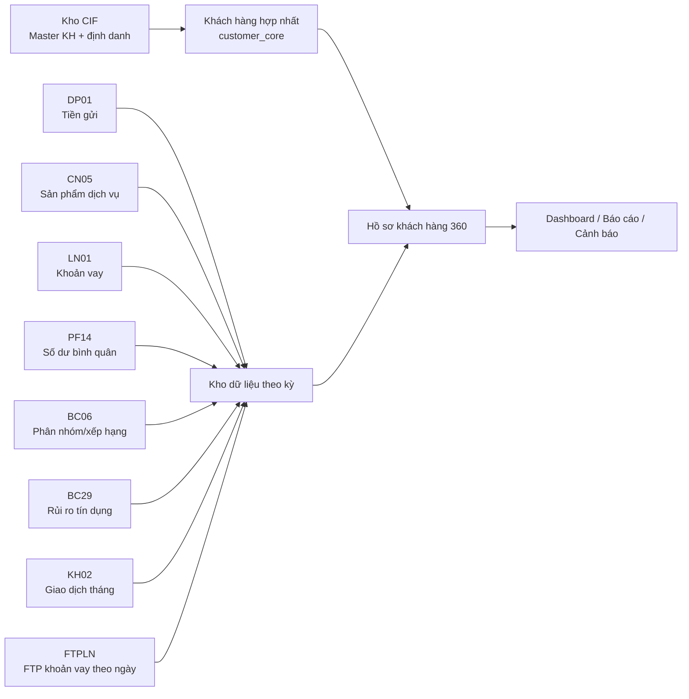
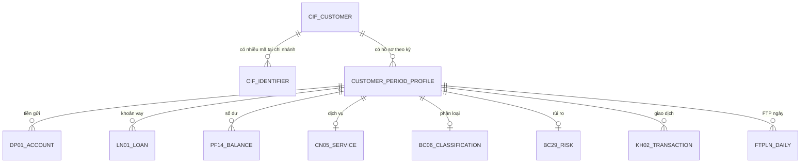
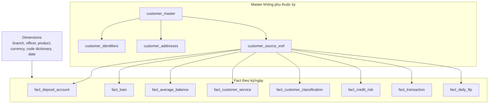

# Phân tích cột dữ liệu nguồn và Kho CIF

> Phiên bản phân tích: 28/07/2026  
> Phạm vi: DP01, CN05, LN01, PF14, BC06, BC29, KH02, FTPLN và CIF  
> Căn cứ: file mẫu trong `documents/`, code importer hiện tại và dữ liệu đang có trong PostgreSQL.

## 1. Mục đích và cách đọc

Tài liệu này trả lời bốn câu hỏi:

1. Mỗi file nguồn đang mô tả đối tượng nghiệp vụ nào?
2. Mỗi cột có ý nghĩa gì và được dùng vào đâu?
3. Cột nào đã được lưu thành trường chuẩn trong database, cột nào mới chỉ lưu bản thô hoặc chưa được khai thác?
4. Dữ liệu thực tế hiện có đang cho thấy điều gì và còn vấn đề chất lượng nào?

Ký hiệu trạng thái ánh xạ:

| Ký hiệu | Ý nghĩa |
|---|---|
| ✅ Chuẩn hóa | Đã được importer ánh xạ vào một cột có kiểu dữ liệu rõ ràng trong database |
| 🟡 Raw | Được giữ trong `raw_data` nhưng chưa có cột chuẩn riêng |
| ⚪ Chưa lưu | Có trong file mẫu nhưng importer hiện chưa lưu; muốn sử dụng phải bổ sung schema/mapping |
| 🔑 | Khóa hoặc thành phần quan trọng để nhận diện, đối chiếu |
| `Suy luận` | Ý nghĩa được suy ra từ tên cột và dữ liệu, cần chủ sở hữu nghiệp vụ xác nhận |

Không nên hiểu số dòng là số khách hàng. Grain của mỗi nguồn khác nhau: DP01/PF14 thường là tài khoản hoặc sản phẩm, LN01 là khoản vay, KH02 là giao dịch, FTPLN là khoản vay theo ngày, còn CIF mới là hồ sơ định danh khách hàng.

## 2. Bức tranh tổng thể

### 2.1 Vai trò của từng nguồn

| Nguồn | Grain chính | Tần suất | Vai trò |
|---|---|---|---|
| CIF | Một mã CIF đầy đủ tại một chi nhánh | Không phụ thuộc kỳ | Nguồn master khách hàng và định danh |
| DP01 | Một tài khoản tiền gửi/sản phẩm tiền gửi tại kỳ | Cuối kỳ | Tiền gửi, thông tin tài khoản và một phần thông tin khách hàng |
| CN05 | Một dòng sử dụng sản phẩm/dịch vụ của khách hàng | Cuối kỳ | Dịch vụ ngân hàng điện tử, thẻ, SMS, tài khoản |
| LN01 | Một khoản giải ngân/khoản vay tại kỳ | Cuối kỳ | Dư nợ, lãi suất, cán bộ tín dụng, mục đích vay |
| PF14 | Một tài khoản/sản phẩm số dư bình quân | Cuối kỳ | Số dư bình quân, cuối tháng, vốn hoạt động |
| BC06 | Một kết quả phân loại khách hàng tại đơn vị | Cuối kỳ | Lợi ích, điểm, nhóm và hạng khách hàng |
| BC29 | Một khách hàng có thông tin rủi ro tín dụng | Cuối kỳ | Nhóm nợ, dự phòng, tài sản bảo đảm, quá hạn |
| KH02 | Một giao dịch của khách hàng trong tháng | Theo khoảng tháng | Doanh số ghi nợ/ghi có và hành vi giao dịch |
| FTPLN | Một khoản vay tại một ngày nghiệp vụ | Hằng ngày | FTP vốn, giá vốn và hiệu quả tín dụng |

### 2.2 Mô hình luồng dữ liệu đề xuất



Nguyên tắc đích: CIF là điểm tham chiếu khách hàng; các nguồn theo kỳ chỉ bổ sung số dư, sản phẩm, giao dịch, lợi ích và rủi ro. Không tiếp tục coi DP01 là nguồn sinh master khách hàng lâu dài.

### 2.3 Khóa đối chiếu



Khóa hiện tại trong kho theo kỳ thường được dựng bằng `mã chi nhánh + mã khách hàng`. Khóa đích nên tham chiếu `customer_core_code` của CIF và duy trì bảng bridge giữa mã nguồn, mã CIF đầy đủ, chi nhánh và khách hàng lõi.

## 3. Hiện trạng dữ liệu thực tế

### 3.1 Dữ liệu nguồn tại kỳ 30/06/2026

| Nguồn | Số dòng | KH phân biệt theo khóa hiện tại | Chi nhánh |
|---|---:|---:|---:|
| BC06 | 180.626 | 177.888 | 7 |
| BC29 | 159 | 159 | 7 |
| CN05 | 653.043 | 570.241 | 7 |
| DP01 | 373.022 | 250.785 | 7 |
| FTPLN | 847.827 | 13.448 | 7 |
| KH02 | 393.896 | 113.920 | 7 |
| LN01 | 29.294 | 12.894 | 7 |
| PF14 | 271.507 | 174.073 | 7 |

Database đang có 6 kỳ từ `20260131` đến `20260630`, với 265.003 khách hàng trong bảng master cũ. Con số master cũ chủ yếu hình thành từ DP01; khi chuyển sang CIF cần có bước mapping và không được thay khóa âm thầm.

Một số chỉ số quan sát tại kỳ `20260630`:

- DP01 có 373.022 tài khoản/dòng, tổng `CURRENT_BALANCE × TYGIA` khoảng **30.644,58 tỷ đồng**.
- 365.668/373.022 dòng DP01 có giấy tờ định danh, tương đương khoảng **98,03%** theo dòng.
- 346.550/373.022 dòng DP01 có số điện thoại, tương đương khoảng **92,90%** theo dòng.
- LN01 có tổng dư nợ quy đổi khoảng **24.627,81 tỷ đồng**, lãi suất trung bình quan sát khoảng **9,3131**; đơn vị lãi suất cần được xác nhận là %/năm.
- PF14 có tổng số dư cuối tháng khoảng **30.893,01 tỷ đồng**, số dư bình quân khoảng **29.484,68 tỷ đồng**.
- FTPLN có dữ liệu 29/30 ngày cho cả 7 chi nhánh; đang thiếu ngày **18/06/2026**. Vì vậy chưa nên coi bộ FTPLN tháng 6 là hoàn chỉnh để đối chiếu toàn tháng.
- KH02 có tổng ghi nợ và ghi có rất lệch nhau trên tập dữ liệu hiện tại. Không nên kết luận cân đối kế toán từ KH02 vì đây có thể chỉ là tập giao dịch được lọc theo nghiệp vụ.

### 3.2 Kho CIF hiện tại

| Chỉ số | Giá trị |
|---|---:|
| Khách hàng master | 21.805 |
| Mã CIF đầy đủ | 21.805 |
| Chi nhánh 2600 | 11.472 |
| Chi nhánh 2602 | 4.525 |
| Chi nhánh 2604 | 5.808 |
| Có `regno` | 21.208 (97,26%) |
| Có số điện thoại | 1.717 (7,87%) |
| Có địa chỉ | 21.782 (99,89%) |
| Hoạt động | 21.783 (99,90%) |
| Không hoạt động | 19 |
| Không hợp lệ | 2 |
| Chưa xác nhận | 1 |
| Xung đột giấy tờ chờ xử lý | 5 nhóm |
| Khách hàng đa chi nhánh trong 3 file mẫu | 0 |

Nhận xét:

- CIF có độ phủ định danh và địa chỉ tốt, nhưng số điện thoại rất thấp; không thể dùng riêng CIF cho hoạt động liên hệ khách hàng.
- 97,46% khách hàng trong mẫu là cá nhân (21.253/21.805). Phần còn lại gồm công ty TNHH, hộ kinh doanh, tổ chức, công ty cổ phần và nhóm tổ chức khác.
- Chưa thấy khách hàng đa chi nhánh trong ba file hiện có không có nghĩa mô hình đa chi nhánh không tồn tại; có thể do mới nhập 3/7 chi nhánh hoặc quy tắc tách mã lõi cần kiểm chứng thêm.
- Năm nhóm `regno` gắn với nhiều mã lõi phải được xử lý theo workflow đối chiếu, không tự động gộp.

## 4. Từ điển DP01 – Tiền gửi

File mẫu `DP01.xlsx`: 33.501 dòng, 63 cột. Backend hiện chuẩn hóa 24/63 cột. Các cột còn lại chưa được lưu trong `raw_data` của pipeline DP01 hiện tại, dù model có trường `raw_data`.

| Cột nguồn | Ý nghĩa nghiệp vụ | Trạng thái |
|---|---|---|
| `MA_CN` 🔑 | Mã chi nhánh quản lý tài khoản | ✅ `ma_cn`, tham gia dựng khóa hiện tại |
| `TAI_KHOAN_HACH_TOAN` | Tài khoản hạch toán/GL liên quan | ⚪ Chưa lưu |
| `MA_KH` 🔑 | Mã khách hàng tại nguồn | ✅ `ma_kh` |
| `TEN_KH` | Tên khách hàng | ✅ `ten_kh` |
| `DP_TYPE_NAME` | Tên loại tiền gửi/sản phẩm huy động | ✅ `dp_type_name` |
| `CCY` | Mã tiền tệ | ✅ `ccy` |
| `CURRENT_BALANCE` | Số dư hiện tại/cuối kỳ theo nguyên tệ | ✅ `current_balance` |
| `RATE` | Lãi suất tài khoản tiền gửi | ⚪ Chưa lưu |
| `SO_TAI_KHOAN` 🔑 | Số tài khoản tiền gửi | ✅ `so_tai_khoan` |
| `OPENING_DATE` | Ngày mở tài khoản | ✅ `opening_date` |
| `MATURITY_DATE` | Ngày đáo hạn | ✅ `maturity_date` |
| `ADDRESS` | Địa chỉ khách hàng trên nguồn tiền gửi | ⚪ Chưa lưu |
| `NOTENO` | Số sổ/chứng từ/ghi chú tham chiếu (`Suy luận`) | ⚪ Chưa lưu |
| `MONTH_TERM` | Kỳ hạn theo tháng hoặc mã kỳ hạn | ✅ `month_term` |
| `TERM_DP_NAME` | Tên sản phẩm tiền gửi có kỳ hạn | ⚪ Chưa lưu |
| `TIME_DP_NAME` | Tên nhóm thời gian/kỳ hạn | ⚪ Chưa lưu |
| `MA_PGD` | Mã phòng giao dịch | ✅ `ma_pgd` |
| `TEN_PGD` | Tên phòng giao dịch | ✅ `ten_pgd` |
| `DP_TYPE_CODE` | Mã loại tiền gửi | ✅ `dp_type_code` |
| `RENEW_DATE` | Ngày tái tục | ⚪ Chưa lưu |
| `CUST_TYPE` | Mã loại khách hàng | ✅ `cust_type` |
| `CUST_TYPE_NAME` | Tên loại khách hàng | ✅ `cust_type_name` |
| `CUST_TYPE_DETAIL` | Mã loại khách hàng chi tiết | ⚪ Chưa lưu |
| `CUST_DETAIL_NAME` | Tên loại khách hàng chi tiết | ⚪ Chưa lưu |
| `PREVIOUS_DP_CAP_DATE` | Ngày nhập vốn/lãi kỳ trước (`Suy luận`) | ⚪ Chưa lưu |
| `NEXT_DP_CAP_DATE` | Ngày nhập vốn/lãi kế tiếp (`Suy luận`) | ⚪ Chưa lưu |
| `ID_NUMBER` | CCCD/CMND/giấy tờ định danh | ✅ `id_number` |
| `ISSUED_BY` | Nơi/cơ quan cấp giấy tờ | ⚪ Chưa lưu |
| `ISSUE_DATE` | Ngày cấp giấy tờ | ⚪ Chưa lưu |
| `SEX_TYPE` | Giới tính/mã giới tính | ✅ `sex_type` |
| `BIRTH_DATE` | Ngày sinh | ✅ `birth_date` |
| `TELEPHONE` | Số điện thoại | ✅ `telephone` |
| `ACRUAL_AMOUNT` | Lãi dự thu/dự chi lũy kế; tên nguồn viết thiếu một chữ `C` (`Suy luận`) | ⚪ Chưa lưu |
| `ACRUAL_AMOUNT_END` | Lãi dự thu/dự chi cuối kỳ (`Suy luận`) | ⚪ Chưa lưu |
| `ACCOUNT_STATUS` | Trạng thái tài khoản | ⚪ Chưa lưu |
| `DRAMT` | Doanh số ghi nợ trong kỳ | ✅ `dramt` |
| `CRAMT` | Doanh số ghi có trong kỳ | ✅ `cramt` |
| `EMPLOYEE_NUMBER` | Mã cán bộ quản lý | ✅ `employee_number` |
| `EMPLOYEE_NAME` | Tên cán bộ quản lý | ✅ `employee_name` |
| `SPECIAL_RATE` | Lãi suất đặc biệt/ưu đãi | ⚪ Chưa lưu |
| `AUTO_RENEWAL` | Chỉ báo tự động tái tục | ⚪ Chưa lưu |
| `CLOSE_DATE` | Ngày đóng tài khoản | ⚪ Chưa lưu |
| `LOCAL_PROVIN_NAME` | Tỉnh/thành theo địa chỉ | ⚪ Chưa lưu |
| `LOCAL_DISTRICT_NAME` | Quận/huyện theo địa chỉ | ⚪ Chưa lưu |
| `LOCAL_WARD_NAME` | Xã/phường theo địa chỉ | ⚪ Chưa lưu |
| `TERM_DP_TYPE` | Mã nhóm tiền gửi có kỳ hạn | ⚪ Chưa lưu |
| `TIME_DP_TYPE` | Mã nhóm thời gian/kỳ hạn | ⚪ Chưa lưu |
| `STATES_CODE` | Mã tỉnh/bang | ⚪ Chưa lưu |
| `ZIP_CODE` | Mã bưu chính | ⚪ Chưa lưu |
| `COUNTRY_CODE` | Mã quốc gia | ⚪ Chưa lưu |
| `TAX_CODE_LOCATION` | Mã địa bàn thuế (`Suy luận`) | ⚪ Chưa lưu |
| `MA_CAN_BO_PT` | Mã cán bộ phụ trách | ⚪ Chưa lưu |
| `TEN_CAN_BO_PT` | Tên cán bộ phụ trách | ⚪ Chưa lưu |
| `PHONG_CAN_BO_PT` | Phòng/đơn vị của cán bộ phụ trách | ⚪ Chưa lưu |
| `NGUOI_NUOC_NGOAI` | Chỉ báo khách hàng là người nước ngoài | ⚪ Chưa lưu |
| `QUOC_TICH` | Quốc tịch | ⚪ Chưa lưu |
| `MA_CAN_BO_AGRIBANK` | Mã nhân sự Agribank | ⚪ Chưa lưu |
| `NGUOI_GIOI_THIEU` | Mã/người giới thiệu | ⚪ Chưa lưu |
| `TEN_NGUOI_GIOI_THIEU` | Tên người giới thiệu | ⚪ Chưa lưu |
| `CONTRACT_COUTS_DAY` | Số ngày hợp đồng; tên nguồn có thể là `CONTRACT_COUNTS_DAY` (`Suy luận`) | ⚪ Chưa lưu |
| `SO_KY_AD_LSDB` | Số kỳ áp dụng lãi suất đặc biệt (`Suy luận`) | ⚪ Chưa lưu |
| `UNTBUSCD` | Mã đơn vị nghiệp vụ | ⚪ Chưa lưu |
| `TYGIA` | Tỷ giá quy đổi về VND | ✅ `tygia` |

Giá trị phân tích chính:

- `CURRENT_BALANCE × TYGIA` dùng để tổng hợp tiền gửi quy đổi.
- `DRAMT`, `CRAMT` phản ánh luồng tiền trong kỳ, không phải số dư.
- `MA_PGD`, cán bộ quản lý và địa bàn có thể phục vụ báo cáo hiệu quả đơn vị nhưng hiện nhiều cột liên quan chưa được lưu.
- DP01 hiện vẫn đang upsert bảng master cũ. Cơ chế này cần dừng hoặc chuyển thành bổ sung thuộc tính sau khi CIF trở thành nguồn master.

## 5. Từ điển CN05 – Sản phẩm và dịch vụ

File mẫu `CN05.xlsx`: 82.802 dòng, 24 cột; toàn bộ 24 cột đã được chuẩn hóa.

| Cột nguồn | Ý nghĩa nghiệp vụ | Trạng thái |
|---|---|---|
| `MA_CN` 🔑 | Mã chi nhánh | ✅ `ma_cn` |
| `MA_KH` 🔑 | Mã khách hàng | ✅ `ma_kh` |
| `TEN_KH` | Tên khách hàng | ✅ `ten_kh` |
| `TKTT_SO_TK` | Số lượng tài khoản thanh toán | ✅ |
| `TKTT_TK_SODEP` | Số tài khoản thanh toán/số đẹp (`Suy luận`, cần xác nhận cách đếm) | ✅ |
| `TK_OSB` | Số lượng/chỉ báo tài khoản OSB | ✅ |
| `TG_TIEN_GUI_LOI_THONG_MINH` | Tiền gửi “Lợi thông minh” | ✅ |
| `TG_TIEN_GUI_TRUC_TUYEN` | Tiền gửi trực tuyến | ✅ |
| `TG_TIEN_GUI_TAI_QUAY` | Tiền gửi tại quầy | ✅ |
| `TG_SMS_TIEN_GUI` | SMS liên quan tiền gửi | ✅ |
| `VV_TONG_SO_LDS` | Tổng số lần/dịch vụ liên quan vay vốn (`Suy luận LDS`) | ✅ |
| `VV_SMS_TIEN_VAY` | SMS tiền vay | ✅ |
| `VV_TONG_SO_LDS_CENTERCUT` | Tổng LDS xử lý tập trung/center-cut (`Suy luận`) | ✅ |
| `THE_GHI_NO_NOI_DIA` | Số lượng/chỉ báo thẻ ghi nợ nội địa | ✅ |
| `THE_GHI_NO_QUOC_TE` | Thẻ ghi nợ quốc tế | ✅ |
| `THE_TIN_DUNG_NOI_DIA` | Thẻ tín dụng nội địa | ✅ |
| `THE_TIN_DUNG_QUOC_TE` | Thẻ tín dụng quốc tế | ✅ |
| `VISA` | Sản phẩm thẻ Visa | ✅ |
| `MASTER` | Sản phẩm thẻ Mastercard | ✅ |
| `JCB` | Sản phẩm thẻ JCB | ✅ |
| `DK_AGRIBANK_PLUS` | Đăng ký Agribank Plus | ✅ |
| `DK_AGRIBANK_PLUS_OTT` | Agribank Plus OTT/biến thể đăng ký (`Suy luận`) | ✅ |
| `SMS_BANKING` | Đăng ký/sử dụng SMS Banking | ✅ |
| `TIEN_VAY` | Sản phẩm/chỉ báo tiền vay | ✅ |

Lưu ý: các trường CN05 hiện parse thành số nguyên. Cần có từ điển chính thức xác nhận `0/1` là chỉ báo hay giá trị là số lượng; không nên mặc định cộng các cột nếu chưa xác nhận grain.

## 6. Từ điển LN01 – Khoản vay

File mẫu `LN01.xlsx`: 2.144 dòng, 79 cột. Backend hiện chuẩn hóa 18/79 cột.

| Cột nguồn | Ý nghĩa nghiệp vụ | Trạng thái |
|---|---|---|
| `BRCD` 🔑 | Mã chi nhánh khoản vay | ✅ `brcd` |
| `CUSTSEQ` 🔑 | Mã khách hàng | ✅ `custseq` |
| `CUSTNM` | Tên khách hàng | ✅ `custnm` |
| `TAI_KHOAN` | Số tài khoản khoản vay | ⚪ |
| `CCY` | Loại tiền | ✅ `ccy` |
| `DU_NO` | Dư nợ hiện tại theo nguyên tệ | ✅ `du_no` |
| `DSBSSEQ` 🔑 | Số thứ tự giải ngân/khoản giải ngân | ✅ `dsbsseq` |
| `TRANSACTION_DATE` | Ngày giao dịch/kỳ dữ liệu | ✅ |
| `DSBSDT` | Ngày giải ngân | ⚪ |
| `DISBUR_CCY` | Loại tiền giải ngân | ⚪ |
| `DISBURSEMENT_AMOUNT` | Số tiền giải ngân | ⚪ |
| `DSBSMATDT` | Ngày đáo hạn khoản giải ngân | ⚪ |
| `BSRTCD` | Mã lãi suất cơ sở (`Suy luận`) | ⚪ |
| `INTEREST_RATE` | Lãi suất cho vay | ✅ |
| `APPRSEQ` | Số phê duyệt/hạn mức | ✅ |
| `APPRDT` | Ngày phê duyệt | ⚪ |
| `APPR_CCY` | Loại tiền phê duyệt | ⚪ |
| `APPRAMT` | Số tiền phê duyệt | ⚪ |
| `APPRMATDT` | Ngày hết hạn phê duyệt | ⚪ |
| `LOAN_TYPE` | Loại khoản vay | ✅ |
| `FUND_RESOURCE_CODE` | Mã nguồn vốn | ⚪ |
| `FUND_PURPOSE_CODE` | Mã mục đích sử dụng vốn | ⚪ |
| `REPAYMENT_AMOUNT` | Số tiền trả nợ | ⚪ |
| `NEXT_REPAY_DATE` | Ngày trả gốc kế tiếp | ⚪ |
| `NEXT_REPAY_AMOUNT` | Số tiền gốc phải trả kế tiếp | ⚪ |
| `NEXT_INT_REPAY_DATE` | Ngày trả lãi kế tiếp | ⚪ |
| `OFFICER_ID` | Mã cán bộ tín dụng/quản lý | ✅ |
| `OFFICER_NAME` | Tên cán bộ | ✅ |
| `INTEREST_AMOUNT` | Số tiền lãi | ⚪ |
| `PASTDUE_INTEREST_AMOUNT` | Lãi quá hạn | ⚪ |
| `TOTAL_INTEREST_REPAY_AMOUNT` | Tổng lãi phải trả | ⚪ |
| `CUSTOMER_TYPE_CODE` | Mã loại khách hàng | ⚪ |
| `CUSTOMER_TYPE_CODE_DETAIL` | Mã loại khách hàng chi tiết | ⚪ |
| `TRCTCD` | Mã đối tác/giao dịch | ✅ |
| `TRCTNM` | Tên đối tác/giao dịch | ✅ |
| `ADDR1` | Địa chỉ khách hàng | ⚪ |
| `PROVINCE` | Mã tỉnh/thành | ⚪ |
| `LCLPROVINNM` | Tên tỉnh/thành địa phương | ⚪ |
| `DISTRICT` | Mã quận/huyện | ⚪ |
| `LCLDISTNM` | Tên quận/huyện | ⚪ |
| `COMMCD` | Mã xã/phường | ⚪ |
| `LCLWARDNM` | Tên xã/phường | ⚪ |
| `LAST_REPAY_DATE` | Ngày trả nợ gần nhất | ⚪ |
| `SECURED_PERCENT` | Tỷ lệ có bảo đảm | ⚪ |
| `NHOM_NO` | Nhóm nợ | ⚪ |
| `LAST_INT_CHARGE_DATE` | Ngày tính/thu lãi gần nhất | ⚪ |
| `EXEMPTINT` | Chỉ báo miễn/giảm lãi | ⚪ |
| `EXEMPTINTTYPE` | Loại miễn/giảm lãi | ⚪ |
| `EXEMPTINTAMT` | Số tiền lãi miễn/giảm | ⚪ |
| `GRPNO` | Mã nhóm khoản vay | ⚪ |
| `BUSCD` | Mã nghiệp vụ | ⚪ |
| `BSNSSCLTPCD` | Mã phân loại ngành/lĩnh vực kinh doanh (`Suy luận`) | ⚪ |
| `USRIDOP` | Người dùng tác nghiệp | ⚪ |
| `ACCRUAL_AMOUNT` | Lãi dự thu | ✅ |
| `ACCRUAL_AMOUNT_END_OF_MONTH` | Lãi dự thu cuối tháng | ✅ |
| `INTCMTH` | Phương pháp tính lãi (`Suy luận`) | ⚪ |
| `INTRPYMTH` | Phương thức trả lãi (`Suy luận`) | ⚪ |
| `INTTRMMTH` | Kỳ/chu kỳ lãi (`Suy luận`) | ⚪ |
| `YRDAYS` | Quy ước số ngày trong năm | ⚪ |
| `REMARK` | Ghi chú | ⚪ |
| `CHITIEU` | Chỉ tiêu nghiệp vụ; cần chủ dữ liệu định nghĩa | ⚪ |
| `CTCV` | Mã chi tiết công việc/chương trình vay; cần xác nhận | ⚪ |
| `CREDIT_LINE_YPE` | Loại hạn mức tín dụng; tên nguồn có thể thiếu `T` | ⚪ |
| `INT_LUMPSUM_PARTIAL_TYPE` | Kiểu trả lãi một lần/từng phần | ⚪ |
| `INT_PARTIAL_PAYMENT_TYPE` | Kiểu thanh toán lãi từng phần | ⚪ |
| `INT_PAYMENT_INTERVAL` | Chu kỳ trả lãi | ⚪ |
| `AN_HAN_LAI` | Chỉ báo ân hạn lãi | ⚪ |
| `PHUONG_THUC_GIAI_NGAN_1` | Phương thức giải ngân thứ nhất | ⚪ |
| `TAI_KHOAN_GIAI_NGAN_1` | Tài khoản nhận giải ngân thứ nhất | ⚪ |
| `SO_TIEN_GIAI_NGAN_1` | Số tiền giải ngân thứ nhất | ⚪ |
| `PHUONG_THUC_GIAI_NGAN_2` | Phương thức giải ngân thứ hai | ⚪ |
| `TAI_KHOAN_GIAI_NGAN_2` | Tài khoản nhận giải ngân thứ hai | ⚪ |
| `SO_TIEN_GIAI_NGAN_2` | Số tiền giải ngân thứ hai | ⚪ |
| `CMT_HC` | CMND/CCCD/hộ chiếu | ⚪ |
| `NGAY_SINH` | Ngày sinh | ⚪ |
| `MA_CB_AGRI` | Mã cán bộ Agribank | ⚪ |
| `MA_NGANH_KT` | Mã ngành kinh tế | ⚪ |
| `TY_GIA` | Tỷ giá quy đổi | ✅ `ty_gia` |
| `OFFICER_IPCAS` | Mã cán bộ IPCAS | ✅ |

Khoảng 61 cột LN01 chưa được lưu gồm nhiều thông tin rất có giá trị cho lịch trả nợ, nhóm nợ, tài sản bảo đảm gián tiếp, ngành kinh tế và miễn giảm lãi. Đây là khoảng trống mapping cần ưu tiên.

## 7. Từ điển PF14 – Số dư bình quân tài khoản

File mẫu `PF14.xlsx`: 17.108 dòng, 23 cột. Backend hiện chuẩn hóa 10/23 cột.

| Cột nguồn | Ý nghĩa nghiệp vụ | Trạng thái |
|---|---|---|
| `TRDATE` | Ngày giao dịch/kỳ số liệu | ⚪ |
| `TRBRCD` 🔑 | Mã chi nhánh giao dịch | ✅ |
| `PRODUCTCODE` | Mã sản phẩm | ✅ |
| `ACCOUNTNO` 🔑 | Số tài khoản | ✅ |
| `INDEXACCOUNTNO` | Số tài khoản chỉ mục/liên kết (`Suy luận`) | ⚪ |
| `CUSTSEQ` 🔑 | Mã khách hàng | ✅ |
| `CUSTNAME` | Tên khách hàng | ✅ |
| `ACCOUNTCODE` | Mã loại/tài khoản hạch toán | ⚪ |
| `AVERAGEBALANCE` | Số dư bình quân tháng | ✅ |
| `MONTHLYENDBALANCE` | Số dư cuối tháng | ✅ |
| `RESERVE` | Số tiền dự trữ/phong tỏa (`Suy luận`) | ⚪ |
| `OPERATIONALFUNDS` | Vốn hoạt động | ✅ |
| `MONTERM` | Kỳ hạn theo tháng | ✅ |
| `OPENDATE` | Ngày mở | ⚪ |
| `MATURITYDATE` | Ngày đáo hạn | ⚪ |
| `CLOSEDATE` | Ngày đóng | ⚪ |
| `CUSTOMERRATE` | Lãi suất khách hàng | ⚪ |
| `PAIDINTEREST` | Lãi đã trả | ⚪ |
| `EXPENSEACCRUALS` | Chi phí lãi dự chi | ⚪ |
| `EXPENSEACCRUALS.1` | Cột dự chi thứ hai bị trùng tên khi đọc Excel; cần xác định tên gốc | ⚪ |
| `TOTALINTEREST` | Tổng tiền lãi | ⚪ |
| `AVGINTEREST` | Lãi suất/tiền lãi bình quân (`Suy luận`) | ⚪ |
| `CCY` | Loại tiền | ✅ |

PF14 phù hợp để tính số dư bình quân và lợi ích vốn. Không nên cộng trực tiếp với DP01 nếu chưa xác định hai nguồn có trùng phạm vi tài khoản hay không.

## 8. Từ điển BC06 – Phân loại và xếp hạng khách hàng

File mẫu `2600_BC06_20260630_2600_2600_0_001__.csv`: 13.697 dòng, 28 cột. Toàn bộ cột được chuẩn hóa và đồng thời giữ trong `raw_data`.

| Cột nguồn | Ý nghĩa nghiệp vụ | Trạng thái |
|---|---|---|
| `MA_CHI_NHANH` 🔑 | Mã chi nhánh phân loại | ✅ `branch_code` |
| `TEN_CHI_NHANH` | Tên chi nhánh | ✅ `branch_name` |
| `MA_KHACH_HANG` 🔑 | Mã khách hàng | ✅ `customer_code` |
| `TEN_KHACH_HANG` | Tên khách hàng | ✅ |
| `LOAI_KHACH_HANG` | Loại khách hàng | ✅ |
| `THANG_PHAN_LOAI` | Tháng phân loại dạng `YYYYMM` | ✅; kiểm tra khớp kỳ trên tên file |
| `LOI_ICH_TG_TAI_CN` | Lợi ích từ tiền gửi tại chi nhánh | ✅ |
| `LOI_ICH_TV_TAI_CN` | Lợi ích từ tiền vay tại chi nhánh | ✅ |
| `LOI_ICH_DV_TAI_CN` | Lợi ích từ dịch vụ tại chi nhánh | ✅ |
| `SDBQ_TGCKH_CN` | Số dư bình quân tiền gửi có kỳ hạn tại chi nhánh | ✅ |
| `SDBQ_TGKKH_CN` | Số dư bình quân tiền gửi không kỳ hạn tại chi nhánh | ✅ |
| `SDBQ_TV` | Số dư bình quân tiền vay | ✅ |
| `DIEM_LOI_ICH_CN` | Điểm lợi ích tại chi nhánh | ✅ |
| `DIEM_SDBQ_CN` | Điểm số dư bình quân tại chi nhánh | ✅ |
| `DIEM_DINH_TINH_CN` | Điểm định tính tại chi nhánh | ✅ |
| `DIEM_KH_CN` | Tổng điểm khách hàng tại chi nhánh | ✅ |
| `TIEU_CHI_BS_CN` | Tiêu chí bổ sung tại chi nhánh | ✅ |
| `NHOM_TAI_CN` | Nhóm khách hàng tại chi nhánh | ✅ |
| `HANG_TAI_CN` | Hạng khách hàng tại chi nhánh | ✅ |
| `NHOM_TT_CN` | Nhóm thị trường tại chi nhánh (`Suy luận`) | ✅ |
| `HANG_TT_CN` | Hạng thị trường tại chi nhánh (`Suy luận`) | ✅ |
| `TIEU_CHI_BS_AGR` | Tiêu chí bổ sung toàn hệ thống Agribank | ✅ |
| `NHOM_AGR` | Nhóm khách hàng cấp hệ thống | ✅ |
| `HANG_AGR` | Hạng khách hàng cấp hệ thống | ✅ |
| `NHOM_TT_AGR` | Nhóm thị trường cấp hệ thống | ✅ |
| `HANG_TT_AGR` | Hạng thị trường cấp hệ thống | ✅ |
| `DON_VI_DIEU_CHINH` | Đơn vị thực hiện điều chỉnh kết quả | ✅ |
| `DON_VI_DAU_MOI` | Đơn vị đầu mối/quản lý chính | ✅ |

BC06 có 177.888 khách hàng phân biệt trong 180.626 dòng tại kỳ tháng 6. Chênh lệch cho thấy một khách hàng có thể xuất hiện ở nhiều đơn vị hoặc nhiều dòng phân loại; khi tổng hợp phải chọn grain và quy tắc ưu tiên `DON_VI_DAU_MOI`.

## 9. Từ điển BC29 – Rủi ro tín dụng

File mẫu `2600_BC29_20260630.csv`: chỉ 5 dòng, 24 cột. Toàn kho tháng 6 có 159 dòng/159 khách hàng tại 7 chi nhánh. Tất cả cột được chuẩn hóa và giữ trong `raw_data`.

| Cột nguồn | Ý nghĩa nghiệp vụ | Trạng thái |
|---|---|---|
| `MA_CN` 🔑 | Mã chi nhánh | ✅ |
| `MA_KH` 🔑 | Mã khách hàng | ✅ |
| `TEN_KH` | Tên khách hàng | ✅ |
| `NHOM_NO` | Nhóm nợ | ✅ |
| `TONG_DN` | Tổng dư nợ | ✅ |
| `TONG_DN_PHAI_TRICH` | Dư nợ làm cơ sở trích lập | ✅ |
| `SO_TRICH_LAP_TRONG_KY` | Số dự phòng trích lập trong kỳ | ✅ |
| `XEP_LOAI` | Xếp loại tín dụng/rủi ro | ✅ |
| `TONG_GTKT_TSDB` | Tổng giá trị khấu trừ của tài sản bảo đảm | ✅ |
| `TONG_TSDB` | Tổng giá trị tài sản bảo đảm | ✅ |
| `BDS` | Giá trị bất động sản bảo đảm | ✅ |
| `DS` | Giá trị động sản bảo đảm | ✅ |
| `GTCG` | Giá trị giấy tờ có giá | ✅ |
| `KHAC` | Giá trị tài sản bảo đảm khác | ✅ |
| `SO_NGAY_QHG` | Số ngày quá hạn gốc | ✅ |
| `SO_NGAY_QHL` | Số ngày quá hạn lãi | ✅ |
| `NGAY_XLRR` | Ngày xử lý rủi ro | ✅ |
| `LAI_DU_THU` | Lãi dự thu | ✅ |
| `DN_NGOAI_BANG` | Dư nợ ngoại bảng | ✅ |
| `DN_TIN_DUNG` | Dư nợ tín dụng | ✅ |
| `DN_THAU_CHI` | Dư nợ thấu chi | ✅ |
| `SO_TIEN_DA_XLRR` | Số tiền đã xử lý rủi ro | ✅ |
| `MA_NHAN_VIEN` | Mã nhân viên quản lý | ✅ |
| `DON_VI_CONG_TAC` | Đơn vị công tác của nhân viên | ✅ |

BC29 là nguồn tập trung rủi ro, không phải toàn bộ khách hàng vay. Số lượng 159 khách hàng rất nhỏ so với 12.894 khách hàng LN01, phù hợp với giả thuyết BC29 chỉ chứa nhóm có rủi ro/điều kiện báo cáo.

## 10. Từ điển KH02 – Giao dịch khách hàng trong tháng

File mẫu `2600_kh02_2026060120260630.csv`: 34.301 dòng, 17 cột. Tên file chứa ngày đầu và ngày cuối; toàn bộ cột được chuẩn hóa và giữ `raw_data`.

| Cột nguồn | Ý nghĩa nghiệp vụ | Trạng thái |
|---|---|---|
| `TRDATE` | Ngày giao dịch | ✅ `transaction_date`; phải nằm trong khoảng tên file |
| `TRBRCD` 🔑 | Mã chi nhánh giao dịch | ✅ `branch_code` |
| `CUSTSEQ` 🔑 | Mã khách hàng | ✅ `customer_code` |
| `CUSTNAME` | Tên khách hàng | ✅ |
| `USERHT` | Người dùng thực hiện giao dịch/hạch toán | ✅ |
| `DYSEQ` | Số thứ tự ngày | ✅ |
| `DYTRSEQ` | Số thứ tự giao dịch trong ngày | ✅ |
| `ACCTCD` | Mã tài khoản hạch toán | ✅ |
| `BUSCD` | Mã nghiệp vụ | ✅ |
| `UNITBUSCD` | Mã đơn vị nghiệp vụ | ✅ |
| `TRCD` | Mã giao dịch | ✅ |
| `TRREF` | Loại/mã tham chiếu giao dịch | ✅ |
| `TRSEQ` 🔑 | Số thứ tự giao dịch | ✅ |
| `TRCTCD` | Mã đối tác/đối ứng giao dịch | ✅ |
| `CBTD` | Mã cán bộ tín dụng/quản lý (`Suy luận`) | ✅ |
| `DRAMT` | Số tiền ghi nợ | ✅ `debit_amount` |
| `CRAMT` | Số tiền ghi có | ✅ `credit_amount` |

Mỗi dòng được tạo `source_row_hash` để hỗ trợ chống trùng nội dung. KH02 nên được dùng để tính doanh số và tần suất theo khách hàng sau khi có danh mục ý nghĩa `ACCTCD/BUSCD/TRCD`; nếu chưa có danh mục, tổng ghi nợ/ghi có chỉ là thống kê thô.

## 11. Từ điển FTPLN – FTP khoản vay theo ngày

File mẫu `2600_FTPLN_20260601.csv`: 2.142 dòng, 31 cột. Tất cả cột được chuẩn hóa và giữ `raw_data`.

| Cột nguồn | Ý nghĩa nghiệp vụ | Trạng thái |
|---|---|---|
| `TRDT` | Ngày nghiệp vụ | ✅ `business_date`; phải khớp ngày trên tên file |
| `BRCD` 🔑 | Mã chi nhánh | ✅ |
| `PRNTBRCD` | Mã chi nhánh cha | ✅ |
| `BUSCD` | Mã nghiệp vụ | ✅ |
| `UNTBUSCD` | Mã đơn vị nghiệp vụ | ✅ |
| `SO_HDTD` 🔑 | Số hợp đồng tín dụng | ✅ |
| `TRREF` | Mã/loại tham chiếu giao dịch | ✅ |
| `TRSEQ` 🔑 | Số thứ tự giao dịch | ✅ |
| `REFNO` | Số tham chiếu | ✅ |
| `NACCTCD` | Mã tài khoản | ✅ |
| `FTPCD` | Mã phương pháp/sản phẩm FTP | ✅ |
| `CUSTSEQ` 🔑 | Mã khách hàng | ✅ |
| `CUSTNM` | Tên khách hàng | ✅ |
| `CUSTTP` | Loại khách hàng | ✅ |
| `TIMETPCD` | Mã loại kỳ hạn/thời gian | ✅ |
| `PLKH` | Phân loại khách hàng | ✅ |
| `FTP` | Lãi suất FTP/giá chuyển vốn | ✅ `ftp_rate` |
| `INTRT` | Lãi suất khách hàng | ✅ `interest_rate` |
| `MUCFTPDC` | Mức điều chỉnh FTP | ✅ `ftp_adjustment` |
| `OPNDT` | Ngày mở/giải ngân | ✅ |
| `MATDT` | Ngày đáo hạn | ✅ |
| `CCY` | Loại tiền | ✅ |
| `LDRBAL` | Dư nợ sổ cái/dư nợ tính FTP | ✅ `ledger_balance` |
| `CPAMT` | Giá vốn trong ngày/kỳ (`Suy luận`) | ✅ `capital_price_amount` |
| `CPLKAMT` | Giá vốn lũy kế (`Suy luận`) | ✅ `accumulated_capital_price` |
| `ECONO_SECT` | Mã ngành kinh tế | ✅ |
| `UDP` | Mã UDP/chương trình nghiệp vụ; cần xác nhận | ✅ |
| `TRCTCD` | Mã đối tác/đối ứng | ✅ |
| `CBTD` | Mã cán bộ tín dụng | ✅ |
| `AQCCDFIN` | Mã tiếp nhận cuối cùng (`final acquisition code`, cần xác nhận) | ✅ |
| `HANGFINAL` | Hạng cuối cùng | ✅ |

Độ sẵn sàng tháng phải kiểm tra theo từng ngày và từng chi nhánh. Tháng 6/2026 hiện có 29 ngày cho mỗi chi nhánh và cùng thiếu ngày 18; không nên lấy tổng `CPAMT/CPLKAMT` làm số tháng hoàn chỉnh trước khi bổ sung ngày này.

## 12. Từ điển Kho CIF – Master khách hàng

Ba file `2600CIF.XLS`, `2602CIF.XLS`, `2604CIF.XLS` có cùng 58 cột. Kho CIF không phụ thuộc kỳ. Importer giữ nguyên toàn bộ 58 cột trong `raw_data`, đồng thời chuẩn hóa các trường quan trọng.

### 12.1 Nhận diện và tên khách hàng

| Cột nguồn | Ý nghĩa nghiệp vụ | Trạng thái |
|---|---|---|
| `custno` 🔑 | Mã CIF đầy đủ 13 chữ số; 4 số đầu là chi nhánh, 9 số sau là mã lõi theo quy tắc hiện tại | ✅ `full_cif_code`, tách `branch_code`, `customer_core_code` |
| `nm` | Tên khách hàng không dấu/chuẩn hệ thống (`Suy luận`) | ✅ `customer_name_ascii` |
| `shrtnm` | Tên viết tắt | ✅ `short_name` |
| `nicknm` | Biệt danh/tên giao dịch | 🟡 Raw |
| `nmloc` | Tên khách hàng bản địa/có dấu | ✅ ưu tiên làm `customer_name` |
| `shrtnmloc` | Tên viết tắt bản địa | ✅ ưu tiên cho `short_name` |
| `nicknmloc` | Biệt danh bản địa | 🟡 Raw |
| `custtpcd` | Loại khách hàng | ✅ `customer_type` |
| `custdtltpcd` | Loại khách hàng chi tiết | ✅ `customer_detail_type` |
| `name_4` | Thành phần tên thứ 4 | 🟡 Raw; cần xác nhận thứ tự tách tên |
| `name_3` | Thành phần tên thứ 3 | 🟡 Raw |
| `name_2` | Thành phần tên thứ 2 | 🟡 Raw |
| `name_1` | Thành phần tên thứ 1 | 🟡 Raw |
| `bkcd` | Mã ngân hàng/đơn vị (`Suy luận`) | 🟡 Raw |

### 12.2 Giấy tờ, điện thoại và địa chỉ

| Cột nguồn | Ý nghĩa nghiệp vụ | Trạng thái |
|---|---|---|
| `regno` 🔑 | Số đăng ký/CMND/CCCD chính | ✅ `registration_number`, chuẩn hóa bỏ khoảng trắng và viết hoa |
| `passno` | Số hộ chiếu | ✅ `passport_number` |
| `dlno` | Số giấy phép lái xe | ✅ `driver_license_number` ở identifier |
| `telnoctry` | Mã quốc gia điện thoại | ✅ ghép vào `telephone` |
| `telnoarea` | Mã vùng điện thoại | ✅ ghép vào `telephone` |
| `telno` | Số điện thoại chính | ✅ ghép vào `telephone` |
| `telnoextn` | Số máy lẻ | ✅ ghép vào `telephone` |
| `addrtpcd` | Mã loại địa chỉ | ✅ `address_type` |
| `addr1` | Dòng địa chỉ 1 không dấu/chuẩn hệ thống | 🟡 Raw |
| `addr2` | Dòng địa chỉ 2 không dấu | 🟡 Raw |
| `addr3` | Dòng địa chỉ 3 không dấu | 🟡 Raw |
| `addr1loc` | Dòng địa chỉ địa phương 1 | ✅ thành phần `full_address` |
| `addr2loc` | Dòng địa chỉ địa phương 2 | ✅ thành phần `full_address` |
| `addr3loc` | Dòng địa chỉ địa phương 3 | ✅ thành phần `full_address` |
| `statescd` | Mã tỉnh/bang | 🟡 Raw |
| `province` | Tỉnh/thành | ✅ |
| `district` | Quận/huyện | ✅ |
| `commune_ward` | Xã/phường | ✅ |

### 12.3 Tham chiếu, trạng thái và ngày cấp

| Cột nguồn | Ý nghĩa nghiệp vụ | Trạng thái |
|---|---|---|
| `refno` | Số tham chiếu khách hàng | 🟡 Raw |
| `estno` | Số đăng ký thành lập (`Suy luận`) | 🟡 Raw |
| `busno` | Số đăng ký kinh doanh (`Suy luận`) | 🟡 Raw |
| `stscd` | Trạng thái khách hàng nguồn | ✅ `source_status`, quy đổi `active/inactive/invalid/unverified` |
| `issueby1` | Nơi cấp giấy tờ 1 | 🟡 Raw |
| `issuedt1` | Ngày cấp giấy tờ 1 | 🟡 Raw, có kiểm tra định dạng ngày |
| `issueby2` | Nơi cấp giấy tờ 2 | 🟡 Raw |
| `issuedt2` | Ngày cấp giấy tờ 2 | 🟡 Raw, có kiểm tra |
| `issueby3` | Nơi cấp giấy tờ 3 | 🟡 Raw |
| `issuedt3` | Ngày cấp giấy tờ 3 | 🟡 Raw, có kiểm tra |
| `issueby4` | Nơi cấp giấy tờ 4 | 🟡 Raw |
| `issuedt4` | Ngày cấp giấy tờ 4 | 🟡 Raw, có kiểm tra |
| `issueby5` | Nơi cấp giấy tờ 5 | 🟡 Raw |
| `issuedt5` | Ngày cấp giấy tờ 5 | 🟡 Raw, có kiểm tra |
| `issueby6` | Nơi cấp giấy tờ 6 | 🟡 Raw |
| `issuedt6` | Ngày cấp giấy tờ 6 | 🟡 Raw, có kiểm tra |
| `taxno` | Mã số thuế | ✅ `tax_number` |

### 12.4 Quan hệ, tác nghiệp và thuộc tính khác

| Cột nguồn | Ý nghĩa nghiệp vụ | Trạng thái |
|---|---|---|
| `firstdt` | Ngày tạo/quan hệ khách hàng lần đầu (`Suy luận`) | 🟡 Raw |
| `usridop1` | Người dùng tác nghiệp/cập nhật | ✅ `operator_user` |
| `incrdt` | Ngày tạo/cập nhật bản ghi (`Suy luận`) | 🟡 Raw, có kiểm tra ngày |
| `empno` | Mã nhân viên liên quan | 🟡 Raw |
| `rltnmngrempno` | Mã nhân viên quản lý quan hệ | 🟡 Raw |
| `emailaddr` | Địa chỉ email | 🟡 Raw |
| `ctrycdnatl` | Mã quốc tịch thứ nhất | ✅ `nationality_code` |
| `ctrycdnatl2` | Mã quốc tịch thứ hai | 🟡 Raw |
| `profnm` | Nghề nghiệp/chức danh (`profession name`) | 🟡 Raw |

### 12.5 Quy tắc kiểm tra CIF hiện tại

1. `custno` phải đúng 13 chữ số.
2. Bốn số đầu của `custno` phải khớp chi nhánh suy ra từ tên file.
3. Mỗi file chỉ chứa một chi nhánh.
4. Mã CIF trùng trong cùng file: giữ dòng đầu hợp lệ, loại dòng trùng phía sau và ghi lỗi theo số dòng.
5. File có checksum giống file đã import thành công: không import lại.
6. Mã CIF đã tồn tại:
   - dữ liệu giống: `Không thay đổi`;
   - dữ liệu khác: cập nhật identifier;
   - cùng mã lõi ở chi nhánh khác: thêm identifier và đánh dấu đa chi nhánh.
7. Cùng mã lõi nhưng `regno/passno/taxno` mâu thuẫn: đưa vào đối chiếu, không tự ghi đè master.
8. Khác mã lõi nhưng trùng `regno`: tạo xung đột giấy tờ, không tự gộp.
9. Các cột ngày được kiểm tra dạng `YYYYMMDD`, khoảng năm 1900 đến năm hiện tại.
10. Toàn bộ 58 giá trị nguồn được giữ trong JSON để có thể chuẩn hóa thêm mà không cần đọc lại file gốc.

## 13. Ma trận đóng góp dữ liệu vào hồ sơ 360

| Nhóm thông tin | CIF | DP01 | CN05 | LN01 | PF14 | BC06 | BC29 | KH02 | FTPLN |
|---|:---:|:---:|:---:|:---:|:---:|:---:|:---:|:---:|:---:|
| Định danh/tên | Chính | Bổ sung | Bổ sung | Bổ sung | Bổ sung | Bổ sung | Bổ sung | Bổ sung | Bổ sung |
| Điện thoại | Thấp | Tốt hơn | — | — | — | — | — | — | — |
| Địa chỉ | Chính | Có nhưng chưa map hết | Có trong LN01 nhưng chưa map | Có | — | — | — | — | — |
| Tiền gửi cuối kỳ | — | Chính | Chỉ báo sản phẩm | — | Có thể bổ trợ | SDBQ tổng hợp | — | Luồng giao dịch | — |
| Số dư bình quân | — | — | — | — | Chính | Có số tổng hợp | — | — | — |
| Dư nợ | — | — | Chỉ báo | Chính | — | SDBQ tổng hợp | Rủi ro | — | Theo ngày |
| Sản phẩm số/thẻ | — | — | Chính | — | — | — | — | Có thể suy ra | — |
| Phân hạng KH | — | — | — | — | — | Chính | Xếp loại rủi ro | — | Hạng cuối |
| Nhóm nợ/rủi ro | — | — | — | Có nhưng chưa map `NHOM_NO` | — | — | Chính | — | — |
| Doanh số giao dịch | — | Có DR/CR | — | — | — | — | — | Chính | — |
| FTP/giá vốn | — | — | — | — | — | Lợi ích tổng hợp | — | — | Chính |
| Cán bộ quản lý | Có mã quan hệ raw | Có | — | Có | — | Đơn vị đầu mối | Có | Có | Có |

## 14. Vấn đề dữ liệu và rủi ro diễn giải

### 14.1 Khác grain

- Một khách hàng có thể có nhiều tài khoản DP01/PF14, nhiều khoản vay LN01 và hàng nghìn dòng FTPLN/KH02.
- Mọi phép join trực tiếp theo khách hàng rồi cộng số tiền có nguy cơ nhân bản dữ liệu.
- Phải tổng hợp từng nguồn về đúng grain `khách hàng + chi nhánh + kỳ` trước khi join.

### 14.2 Khóa khách hàng

- Khóa cũ `chi nhánh + mã KH` có thể tạo nhiều khách hàng cho cùng một người.
- Khóa CIF lõi hiện được tách từ 9 số sau của mã 13 số; cần xác nhận bằng thêm 4 chi nhánh còn lại.
- CCCD/MST không được dùng làm khóa duy nhất tuyệt đối trước khi xử lý ngoại lệ trùng/sai giấy tờ.

### 14.3 Đơn vị tiền và tỷ giá

- DP01 và LN01 có `CCY` và tỷ giá; phải quy đổi trước khi tổng hợp toàn hệ thống.
- PF14 có `CCY` nhưng importer chưa có tỷ giá riêng trong bảng; cần join bảng tỷ giá theo kỳ.
- BC06 có các trường lợi ích/số dư tổng hợp nhưng chưa ghi rõ đơn vị; phải xác nhận VND, nghìn đồng hay triệu đồng.
- KH02 và BC29 cũng cần xác nhận đơn vị tiền từ chủ nguồn.

### 14.4 Trường mã cần danh mục

Các cột như `BUSCD`, `TRCD`, `ACCTCD`, `FTPCD`, `CUSTTP`, `PLKH`, `STscd`, `NHOM_NO`, `HANGFINAL` chỉ có thể diễn giải chính xác khi có bảng danh mục mã. Nên tạo `source_code_dictionary` gồm:

```text
source_type, column_name, code_value, code_label,
valid_from, valid_to, owner, description
```

### 14.5 Cột có tên chưa rõ hoặc lỗi chính tả

- `ACRUAL_AMOUNT` nên xác nhận có phải `ACCRUAL_AMOUNT`.
- `CONTRACT_COUTS_DAY` có thể là `CONTRACT_COUNTS_DAY`.
- `CREDIT_LINE_YPE` có thể thiếu chữ `T`.
- `EXPENSEACCRUALS.1` là dấu hiệu hai cột trùng tên trong Excel.
- `VV_TONG_SO_LDS`, `DK_AGRIBANK_PLUS_OTT`, `AQCCDFIN`, `UDP`, `CTCV`, `CHITIEU` cần định nghĩa chính thức.

## 15. Mô hình dữ liệu đích khuyến nghị



Bảng bridge `customer_source_xref` nên có tối thiểu:

| Trường | Mục đích |
|---|---|
| `customer_id` | ID nội bộ ổn định của master CIF |
| `source_type` | DP01/LN01/... |
| `source_branch_code` | Chi nhánh tại nguồn |
| `source_customer_code` | Mã KH nguyên bản |
| `full_cif_code` | Mã CIF đầy đủ nếu xác định được |
| `match_method` | `exact_cif`, `core_code`, `identity`, `manual` |
| `match_score` | Điểm tin cậy |
| `status` | matched/review/rejected |
| `valid_from`, `valid_to` | Hiệu lực ánh xạ |
| `reviewed_by`, `reviewed_at` | Kiểm soát thủ công |

## 16. Thứ tự ưu tiên triển khai

1. **Chốt khóa CIF:** nhập đủ 7 chi nhánh, đo trùng mã lõi và trùng giấy tờ.
2. **Tạo bridge mã nguồn → CIF:** không sửa trực tiếp lịch sử dữ liệu cũ.
3. **Bổ sung raw cho DP01/LN01/PF14:** tránh mất các cột chưa mapping ở lần import tiếp theo.
4. **Ưu tiên mapping LN01:** nhóm nợ, lịch trả nợ, mục đích vay, ngành kinh tế, giấy tờ và thông tin địa bàn.
5. **Bổ sung mapping DP01:** địa chỉ, ngày cấp giấy tờ, trạng thái tài khoản, lãi suất và cán bộ phụ trách.
6. **Chốt danh mục mã:** đặc biệt KH02 và FTPLN trước khi xây báo cáo doanh số/FTP.
7. **Kiểm soát FTPLN đủ ngày:** chỉ bật trạng thái sẵn sàng khi mọi chi nhánh đủ ngày bắt buộc.
8. **Định nghĩa công thức báo cáo:** mỗi KPI ghi rõ nguồn, grain, điều kiện lọc, tỷ giá và cách chống nhân bản.

## 17. Các công thức khởi đầu có thể dùng

| Chỉ tiêu | Công thức đề xuất | Điều kiện |
|---|---|---|
| Tiền gửi cuối kỳ quy đổi | `SUM(DP01.CURRENT_BALANCE × tỷ giá)` | Tổng hợp tài khoản trước khi join KH |
| Dư nợ quy đổi | `SUM(LN01.DU_NO × TY_GIA)` | Loại bản ghi đóng/không hợp lệ theo quy tắc nghiệp vụ |
| Số dư bình quân | `SUM(PF14.AVERAGEBALANCE × tỷ giá kỳ)` | Xác nhận phạm vi tài khoản |
| Doanh số ghi có | `SUM(KH02.CRAMT)` | Lọc danh mục giao dịch được tính |
| Doanh số ghi nợ | `SUM(KH02.DRAMT)` | Lọc danh mục giao dịch được tính |
| Tổng lợi ích BC06 | `LOI_ICH_TG_TAI_CN + LOI_ICH_TV_TAI_CN + LOI_ICH_DV_TAI_CN` | Xác nhận đơn vị và tránh cộng lại giữa đơn vị |
| Tỷ lệ bao phủ TSĐB | `TONG_GTKT_TSDB / NULLIF(TONG_DN_PHAI_TRICH, 0)` | BC29 |
| Chênh lệch lãi suất | `INTRT - FTP - MUCFTPDC` hoặc công thức được nghiệp vụ phê duyệt | FTPLN; dấu của điều chỉnh cần xác nhận |
| Giá vốn lũy kế tháng | Không cộng snapshot hằng ngày; chọn ngày cuối hoặc công thức dòng phát sinh | Cần xác định `CPLKAMT` là stock hay flow |

## 18. Quy trình duy trì tài liệu

Mỗi lần thêm hoặc đổi file nguồn:

1. Lưu header và checksum mẫu.
2. So sánh schema với phiên bản trước.
3. Gắn owner và mô tả cho cột mới.
4. Xác định grain, khóa tự nhiên, đơn vị, frequency và quy tắc ngày.
5. Cập nhật mapping database.
6. Chạy profiling: tỷ lệ null, distinct, min/max, top value, duplicate key.
7. Cập nhật trạng thái `✅/🟡/⚪` trong tài liệu này.
8. Thêm test importer để thiếu/thừa/đổi tên cột được báo rõ.
9. Chỉ cho phép nguồn sang trạng thái “Sẵn sàng” khi đạt rule bắt buộc.

## 19. Các điểm cần nghiệp vụ xác nhận

- 9 số cuối `custno` có luôn là mã khách hàng lõi dùng chung giữa mọi chi nhánh hay không.
- Ý nghĩa và miền giá trị chính thức của `custtpcd`, `custdtltpcd`, `stscd`.
- `regno` có thể chứa loại giấy tờ nào ngoài CCCD/CMND.
- Đơn vị tiền của BC06, BC29, KH02.
- `CN05` là số lượng hay cờ 0/1 ở từng cột.
- Công thức lợi ích và điểm trong BC06.
- Ý nghĩa chính thức của `CPAMT`, `CPLKAMT`, `MUCFTPDC`.
- KH02 bao gồm toàn bộ giao dịch hay chỉ giao dịch theo một danh mục tài khoản/mã nghiệp vụ.
- Quy tắc xử lý ngày nghỉ đối với FTPLN: bắt buộc đủ ngày dương lịch hay chỉ ngày làm việc.
- Tên gốc của hai cột `EXPENSEACCRUALS` trong PF14.

## Phụ lục A. Các file bổ sung và danh mục đang có trong `documents/`

Các file dưới đây không thuộc tám nguồn chính, nhưng đã tham gia hoặc có thể tham gia xử lý hồ sơ khách hàng.

### A.1 Bảo lãnh/LC

File `BaoLanhT62026.xls`: 267 dòng, 16 cột. Importer tùy chọn hiện lưu dữ liệu chuẩn và giữ raw.

| Cột | Ý nghĩa |
|---|---|
| `Tai_Khoan` | Tài khoản liên quan bảo lãnh/LC |
| `Ma_CN` | Mã chi nhánh |
| `Ma_Kh` | Mã khách hàng |
| `Ten_KH` | Tên khách hàng |
| `So_HDBL` | Số hợp đồng bảo lãnh |
| `Ngay_bd` | Ngày bắt đầu hiệu lực |
| `Ngayhethl` | Ngày hết hiệu lực |
| `Loaibllc` | Loại bảo lãnh hoặc LC; dùng để dựng cờ `is_bao_lanh/is_lc` |
| `tien_te` | Mã tiền tệ |
| `Nguyete` | Số tiền nguyên tệ |
| `Ty_gia` | Tỷ giá |
| `VND` | Số tiền VND |
| `NtQuydoi` | Ngoại tệ quy đổi (`Suy luận`); hiện chỉ nằm trong raw |
| `VND1` | Giá trị VND thứ hai (`Suy luận`); hiện chỉ nằm trong raw |
| `Sohdhm` | Số hợp đồng hạn mức (`Suy luận`); hiện chỉ nằm trong raw |
| `SoTien` | Số tiền nghiệp vụ |

### A.2 OAB/Loa biến động số dư

File `OAB-ThongKeLoaDangKyT62026.xlsx`: 51 dòng, 11 cột. File có hai cột tiêu đề trống và một số cột layout; importer đọc theo vị trí.

| Vị trí/cột | Ý nghĩa |
|---|---|
| Cột 0 `Unnamed: 0` | Cột trình bày/STT; không sử dụng |
| `Mã` | Mã bản ghi/dịch vụ; lưu raw |
| Cột 2 `Unnamed: 2` | Cột trình bày; không sử dụng |
| `Chi nhánh` | Chuỗi `mã - tên`; được tách thành mã và tên chi nhánh |
| `Nhà cung cấp Loa` | Nhà cung cấp dịch vụ loa |
| Cột 5 `Unnamed: 5` | Cột trình bày; không sử dụng |
| `Tên KH` | Tên khách hàng |
| `TK ảo` | Tài khoản ảo |
| `TK Agribank` 🔑 | Tài khoản Agribank; đối chiếu với số tài khoản DP01 |
| `SĐT` | Số điện thoại |
| `Số căn cước` | CCCD/CMND |

Rủi ro: đọc theo vị trí cột khiến importer dễ sai khi nhà cung cấp chèn/xóa cột. Nên chuyển sang nhận diện header sau khi chuẩn hóa tên.

### A.3 Danh mục chi nhánh

File `Danh sach chi nhanh.xlsx`, sheet `Sheet1`: 48 dòng.

| Cột | Ý nghĩa |
|---|---|
| `BRCD` | Mã chi nhánh |
| `Name` | Tên chi nhánh |
| `TRSTCD` | Mã điểm giao dịch/đơn vị trực thuộc |
| `TRSTName` | Tên điểm giao dịch/đơn vị |

Đây nên là nguồn dimension tổ chức, không phải fact theo kỳ. Cần unique theo `BRCD + TRSTCD` và có thời gian hiệu lực nếu cơ cấu thay đổi.

### A.4 Danh mục cán bộ

File `Danh sách chi tiết cán bộ.xlsx`, sheet `CHITIET`: 368 dòng.

| Cột | Ý nghĩa |
|---|---|
| `Mã NV` | Mã nhân viên |
| `Mã CBTD` | Mã cán bộ tín dụng |
| `User IPCAS` | Tài khoản người dùng IPCAS |
| `Tên NV` | Tên nhân viên |
| `BRCD` | Mã chi nhánh |
| `TRSTCD` | Mã điểm giao dịch/đơn vị |
| `TRSTName` | Tên điểm giao dịch/đơn vị |

Danh mục này dùng để hợp nhất `EMPLOYEE_NUMBER`, `OFFICER_ID`, `OFFICER_IPCAS`, `MA_CB_AGRI`, `CBTD`, `MA_NHAN_VIEN` về một cán bộ nội bộ. Nên có bảng alias mã cán bộ vì một người có thể mang nhiều mã trên các nguồn.

---

Tài liệu này mô tả đúng hiện trạng code và dữ liệu tại thời điểm ghi. Các ý nghĩa đánh dấu `Suy luận` không nên được dùng làm căn cứ báo cáo chính thức trước khi được chủ nguồn xác nhận.
