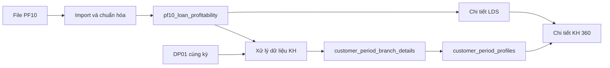

# PHÂN TÍCH, THIẾT KẾ VÀ CÁCH TÍNH NGUỒN PF10

> Tài liệu chuẩn cho việc import, lưu kho, đối chiếu và tổng hợp PF10 vào Profile khách hàng C360.
>
> Cập nhật: 29/07/2026.

## 1. Mục đích của PF10

PF10 cung cấp dữ liệu dư nợ và lãi theo từng tài khoản/LDS của khách hàng trong tháng. Nguồn này được dùng để tính:

- Dư nợ ngắn hạn cuối tháng và bình quân.
- Dư nợ trung dài hạn cuối tháng và bình quân.
- Dư nợ thấu chi cuối tháng và bình quân.
- Số lượng LDS.
- Lãi phát sinh, lãi dự thu và lãi điều chỉnh sổ sách.
- Chi tiết khoản vay theo khách hàng và chi nhánh.

PF10 không thay thế trường tổng dư nợ hiện tại lấy từ LN01. Sáu chỉ tiêu PF10 được lưu thành các trường riêng để không làm thay đổi báo cáo cũ.

## 2. File mẫu và quy tắc tên

File đã phân tích:

```text
documents/2600_pf10_20260630.csv
```

Đặc điểm file mẫu:

- UTF-8 BOM.
- Phân cách bằng dấu phẩy.
- 2.247 dòng dữ liệu.
- 20 cột.
- 764 mã khách hàng lõi.
- 2.247 số LDS khác nhau.
- Không có LDS trùng trong file mẫu.

Tên file hợp lệ:

```text
MACN_PF10_yyyymmdd.csv
MACN_PF10_yyyymmdd.xlsx
```

Ví dụ:

```text
2600_PF10_20260630.csv
2602_pf10_20260630.xlsx
```

Trong đó:

- `2600`: mã chi nhánh.
- `PF10`: mã nguồn.
- `20260630`: kỳ dữ liệu.
- Không phân biệt chữ hoa/chữ thường đối với `PF10`.

## 3. Grain dữ liệu và các khóa

Grain của PF10:

> Một dòng là một tài khoản/LDS của một khách hàng tại một chi nhánh trong một kỳ.

Khóa truy vết an toàn:

```text
period_key + branch_code + account_number
```

Các cấp tổng hợp:

```text
LDS / ACCTNO
    ↓
Khách hàng tại chi nhánh
    ↓
Khách hàng lõi trên toàn bộ chi nhánh
```

## 4. Chuẩn hóa mã khách hàng

### 4.1. Mã chi nhánh

Lấy từ:

```text
TRBRCD
```

Ví dụ:

```text
2600
2602
2604
```

Quy tắc:

- Chuyển thành chuỗi.
- Trim khoảng trắng hai đầu.
- Không chuyển thành số nguyên để tránh làm thay đổi mã.

### 4.2. Mã khách hàng lõi

Lấy từ:

```text
CUSTSEQ
```

Giá trị nguồn có thể có dạng:

```text
'180870874
```

Chuẩn hóa:

1. Chuyển về chuỗi.
2. Trim khoảng trắng hai đầu.
3. Bỏ dấu `'` ở đầu.
4. Trim lại sau khi bỏ dấu.
5. Giữ nguyên các số `0` ở đầu.

Kết quả:

```text
180870874
```

### 4.3. Mã khách hàng theo chi nhánh

Công thức:

```text
branch_customer_key = TRBRCD + customer_core_code
```

Ví dụ:

```text
TRBRCD            = 2600
customer_core_code = 180870874
branch_customer_key = 2600180870874
```

Hai mã:

```text
2600012345678
2602012345678
```

có cùng mã lõi:

```text
012345678
```

Do đó đây là cùng một khách hàng nhưng có quan hệ tại hai chi nhánh.

## 5. Từ điển 20 cột PF10

| Cột nguồn | Cột DB | Kiểu dữ liệu | Ý nghĩa |
|---|---|---|---|
| `TRDATE` | `report_month` | Chuỗi `yyyymm` | Tháng báo cáo |
| `TRBRCD` | `branch_code` | Chuỗi | Mã chi nhánh |
| `ACCTNO` | `account_number` | Chuỗi | Số LDS/tài khoản khoản vay |
| `CUSTSEQ` | `customer_code` | Chuỗi | Mã khách hàng lõi |
| `CUSTNAME` | `customer_name` | Chuỗi | Tên khách hàng |
| `LNTYPE` | `loan_type` | Chuỗi | Mã loại vay |
| `BSACCTCD` | `balance_sheet_account_code` | Chuỗi | Mã tài khoản bảng cân đối |
| `AVGBAL` | `average_balance` | Numeric | Dư nợ bình quân tháng |
| `EOMBAL` | `end_of_month_balance` | Numeric | Dư nợ cuối tháng |
| `MONTERM` | `month_term` | Integer | Kỳ hạn theo tháng |
| `OPNDT` | `opening_date` | Date | Ngày mở LDS/ngày giải ngân theo nguồn |
| `MATDT` | `maturity_date` | Date | Ngày đến hạn |
| `CLSDT` | `closing_date` | Date | Ngày đóng; `00000000` chuyển thành `NULL` |
| `CONTRATE` | `contract_rate` | Numeric | Lãi suất hợp đồng |
| `MMTOTINT` | `monthly_total_interest` | Numeric | Tổng lãi tháng theo nguồn |
| `BVCORRINT` | `book_correction_interest` | Numeric | Lãi điều chỉnh giá trị sổ sách |
| `ACCRUALS` | `accruals` | Numeric | Lãi dự thu/lũy kế theo nguồn |
| `INTEREST` | `interest_amount` | Numeric | Lãi phát sinh trong kỳ |
| `RATIO` | `ratio` | Numeric | Tỷ lệ nghiệp vụ của nguồn |
| `CCY` | `currency_code` | Chuỗi | Loại tiền |

Toàn bộ dòng gốc được giữ thêm trong `raw_data` để truy vết khi cách hiểu nghiệp vụ thay đổi.

## 6. Phân loại khoản vay

| `LNTYPE` | Phân loại |
|---|---|
| `100` | Ngắn hạn |
| `110` | Trung hạn |
| `120` | Dài hạn |
| `241` | Thấu chi |

Trên giao diện:

- `110` và `120` được gộp thành nhóm **Trung dài hạn**.
- Trong kho và chi tiết LDS vẫn giữ nguyên mã `110` hoặc `120`.

Không tự động đưa mã `LNTYPE` chưa biết vào một trong ba nhóm. Các mã mới phải được cấu hình nghiệp vụ trước.

## 7. Sáu công thức dư nợ

### 7.1. Dư nợ ngắn hạn cuối tháng

Mã chỉ tiêu:

```text
DUNO_NHTT
```

Công thức:

```sql
SUM(EOMBAL) WHERE LNTYPE = '100'
```

Cột Profile:

```text
du_no_ngan_han
```

### 7.2. Dư nợ ngắn hạn bình quân

Mã chỉ tiêu:

```text
DUNO_NHTTBQ
```

Công thức:

```sql
SUM(AVGBAL) WHERE LNTYPE = '100'
```

Cột Profile:

```text
du_no_ngan_han_bq
```

### 7.3. Dư nợ trung dài hạn cuối tháng

Mã chỉ tiêu:

```text
DUNO_TDHTT
```

Công thức:

```sql
SUM(EOMBAL) WHERE LNTYPE IN ('110', '120')
```

Cột Profile:

```text
du_no_trung_dai_han
```

### 7.4. Dư nợ trung dài hạn bình quân

Mã chỉ tiêu:

```text
DUNO_TDHTTBQ
```

Công thức:

```sql
SUM(AVGBAL) WHERE LNTYPE IN ('110', '120')
```

Cột Profile:

```text
du_no_trung_dai_han_bq
```

### 7.5. Dư nợ thấu chi cuối tháng

Mã chỉ tiêu:

```text
DUNO_TC
```

Công thức:

```sql
SUM(EOMBAL) WHERE LNTYPE = '241'
```

Cột Profile:

```text
du_no_thau_chi
```

### 7.6. Dư nợ thấu chi bình quân

Mã chỉ tiêu:

```text
DUNO_TCBQ
```

Công thức:

```sql
SUM(AVGBAL) WHERE LNTYPE = '241'
```

Cột Profile:

```text
du_no_thau_chi_bq
```

## 8. Tổng hợp khách hàng đa chi nhánh

Phải tổng hợp theo hai bước.

### Bước 1: Theo khách hàng tại từng chi nhánh

Khóa nhóm:

```text
period_key + customer_core_code + branch_code
```

Ví dụ:

```text
KH 012345678 tại 2600
KH 012345678 tại 2602
```

Mỗi chi nhánh có riêng:

- 6 chỉ tiêu dư nợ.
- Số LDS.
- Tổng `INTEREST`.
- Tổng `ACCRUALS`.
- Tổng `BVCORRINT`.

Kết quả lưu vào:

```text
customer_period_branch_details
```

### Bước 2: Tổng toàn khách hàng

Khóa nhóm:

```text
period_key + customer_core_code
```

Công thức:

```text
Chỉ tiêu tổng KH = SUM(chỉ tiêu của tất cả chi nhánh)
```

Ví dụ:

```text
DUNO_NHTT toàn KH
= DUNO_NHTT tại 2600
+ DUNO_NHTT tại 2602
```

Kết quả lưu vào:

```text
customer_period_profiles
```

## 9. Ranh giới giữa Import và Xử lý dữ liệu KH

### 9.1. Khi import PF10 vào kho

Chỉ thực hiện:

- Kiểm tra tên file.
- Kiểm tra đủ 20 cột.
- Kiểm tra `TRBRCD` khớp mã chi nhánh trên tên file.
- Kiểm tra `TRDATE` khớp tháng trên tên file.
- Chuẩn hóa mã khách hàng.
- Chuyển đổi số và ngày.
- Kiểm tra file trùng bằng SHA-256 và metadata.
- Lưu dữ liệu vào `pf10_loan_profitability`.
- Cập nhật trạng thái nguồn và độ sẵn sàng.

Không thực hiện:

- Không đối chiếu DP01.
- Không đối chiếu CIF.
- Không từ chối file vì mã KH chưa có trong DP01.
- Không tạo hoặc cập nhật Profile KH.

### 9.2. Khi chạy Xử lý dữ liệu KH

Lúc này mới thực hiện:

1. Lấy danh sách mã khách hàng lõi trong DP01 của kỳ.
2. Chuẩn hóa `PF10.CUSTSEQ`.
3. Ghép PF10 với DP01 theo mã khách hàng lõi.
4. PF10 có mã lõi trong DP01 được đưa vào Profile.
5. PF10 chưa có mã lõi trong DP01 vẫn nằm trong kho nhưng không tạo Profile.
6. Tổng hợp theo chi nhánh.
7. Tổng hợp toàn khách hàng.

Điều kiện hiện tại:

```sql
PF10.customer_code = DP01.ma_kh
```

Khi Kho CIF hoàn thiện, nguồn tham chiếu sẽ đổi từ DP01 sang CIF mà không thay đổi dữ liệu PF10 gốc.

## 10. Đối chiếu PF10 với DP01

Nên phân loại ba trạng thái:

| Trạng thái | Ý nghĩa |
|---|---|
| `same_branch` | Mã lõi có trong DP01 tại cùng chi nhánh |
| `other_branch` | Mã lõi có trong DP01 nhưng tại chi nhánh khác |
| `not_found` | Không tìm thấy mã lõi trong DP01 của kỳ |

Quy tắc:

- `same_branch` và `other_branch` được tổng hợp vào khách hàng lõi.
- `not_found` không tạo Profile nhưng không bị xóa khỏi kho.
- Việc không khớp DP01 không làm import PF10 lỗi.

Kết quả file mẫu tại chi nhánh `2600`, kỳ `20260630`:

- 764 mã khách hàng PF10.
- 761 mã tìm thấy trong DP01.
- 3 mã chưa tìm thấy.
- Tỷ lệ khớp khoảng 99,61%.

## 11. Xử lý các cột lãi

Ba trường được lưu và tổng hợp riêng:

| Cột nguồn | Cột tổng hợp | Cách hiển thị tạm |
|---|---|---|
| `INTEREST` | `pf10_interest` | Lãi phát sinh trong tháng |
| `ACCRUALS` | `pf10_accruals` | Lãi dự thu/lũy kế |
| `BVCORRINT` | `pf10_book_correction_interest` | Lãi điều chỉnh sổ sách |

Công thức tổng hợp trong một kỳ:

```sql
SUM(INTEREST)
SUM(ACCRUALS)
SUM(BVCORRINT)
```

Tổng hợp lần lượt:

1. Theo LDS.
2. Theo khách hàng tại chi nhánh.
3. Theo khách hàng lõi trên toàn bộ chi nhánh.

Không mặc định:

```text
ACCRUALS - BVCORRINT = INTEREST
```

Trong file mẫu, quan hệ này chỉ đúng 155/2.247 dòng, khoảng 6,9%.

Vì vậy:

- Không tính một cột từ hai cột còn lại.
- Không dùng ngay ba cột để tính lợi nhuận khách hàng.
- Không cộng snapshot của nhiều kỳ thành một chỉ tiêu.
- Giữ dữ liệu gốc cho đến khi có mô tả nghiệp vụ chính thức.

## 12. Lãi suất và tỷ lệ

`CONTRATE` và `RATIO` là tỷ lệ, không được cộng trực tiếp.

Nếu cần lãi suất bình quân theo dư nợ cuối tháng:

```text
Lãi suất bình quân
= SUM(CONTRATE × EOMBAL)
/ SUM(EOMBAL)
```

Nếu báo cáo theo số dư bình quân:

```text
Lãi suất bình quân theo tháng
= SUM(CONTRATE × AVGBAL)
/ SUM(AVGBAL)
```

Phải xử lý trường hợp mẫu số bằng 0.

`RATIO` chỉ nên tính bình quân gia quyền sau khi nghiệp vụ xác nhận chính xác ý nghĩa.

## 13. Dữ liệu ngày

### `OPNDT`

Lưu tại:

```text
opening_date
```

Hiển thị:

```text
Ngày mở/giải ngân
```

Tên hiển thị này mang tính tạm thời. Cần xác nhận liệu một LDS có thể giải ngân nhiều lần hay không.

### `MATDT`

Lưu tại:

```text
maturity_date
```

Hiển thị:

```text
Ngày đến hạn
```

### `CLSDT`

Lưu tại:

```text
closing_date
```

Giá trị:

```text
00000000
```

được chuyển thành:

```text
NULL
```

## 14. Thiết kế database

### 14.1. Kho chi tiết

```text
pf10_loan_profitability
```

Lưu từng LDS và toàn bộ 20 cột nguồn đã chuẩn hóa.

### 14.2. Tổng hợp theo chi nhánh

```text
customer_period_branch_details
```

Các trường PF10:

- `du_no_ngan_han`
- `du_no_ngan_han_bq`
- `du_no_trung_dai_han`
- `du_no_trung_dai_han_bq`
- `du_no_thau_chi`
- `du_no_thau_chi_bq`
- `pf10_lds_count`
- `pf10_interest`
- `pf10_accruals`
- `pf10_book_correction_interest`

### 14.3. Tổng hợp toàn khách hàng

```text
customer_period_profiles
```

Sử dụng cùng các trường trên, được cộng từ tất cả chi nhánh của cùng mã khách hàng lõi.



## 15. API chi tiết PF10

Endpoint:

```http
GET /api/customer-processing/pf10-loans
```

Tham số:

| Tham số | Bắt buộc | Ý nghĩa |
|---|---|---|
| `period_key` | Có | Kỳ dữ liệu |
| `ma_kh` | Có | Mã khách hàng lõi |
| `category` | Không | `short_term`, `medium_long_term`, `overdraft` |
| `branch_code` | Không | Lọc theo chi nhánh |
| `page` | Không | Trang |
| `page_size` | Không | Số LDS mỗi trang |

API trả về:

- Ba nhóm loại vay.
- Số LDS.
- Dư nợ cuối tháng.
- Dư nợ bình quân.
- Tổng lãi.
- Số chi nhánh.
- Danh sách chi tiết LDS.
- Trạng thái đối chiếu DP01.

## 16. Hiển thị trên KH 360

Trong chi tiết khách hàng có tab:

```text
Tín dụng PF10
```

Ba card:

1. Ngắn hạn.
2. Trung dài hạn.
3. Thấu chi.

Mỗi card hiển thị:

- Dư nợ cuối tháng.
- Dư nợ bình quân.
- Số LDS.
- Số chi nhánh.
- Lãi phát sinh trong tháng.

Khi bấm card, hiển thị:

- Chi nhánh.
- Số LDS.
- Loại vay.
- Dư nợ cuối tháng.
- Dư nợ bình quân.
- Ngày mở/giải ngân.
- Ngày đến hạn.
- Kỳ hạn.
- Lãi suất hợp đồng.
- `INTEREST`.
- `ACCRUALS`.
- `BVCORRINT`.
- `RATIO`.
- `CCY`.
- Trạng thái đối chiếu DP01.

## 17. Quy trình vận hành

```text
Upload PF10
    ↓
Kiểm tra cấu trúc và import vào kho
    ↓
PF10 xuất hiện trong trạng thái nguồn
    ↓
Đủ nguồn theo chi nhánh
    ↓
Chạy Xử lý dữ liệu KH
    ↓
Đối chiếu mã lõi PF10 với DP01
    ↓
Tổng hợp 6 chỉ tiêu theo chi nhánh
    ↓
Tổng hợp toàn khách hàng
    ↓
Xem tab Tín dụng PF10 trong KH 360
```

Sau khi upload PF10 thành công, dữ liệu không tự ghi vào Profile cũ. Phải chạy lại **Xử lý dữ liệu KH** của kỳ.

## 18. Kiểm thử đã thực hiện

Bộ dữ liệu kiểm thử:

| Loại | `EOMBAL` | `AVGBAL` |
|---|---:|---:|
| `100` | 1.000 | 900 |
| `110` | 2.000 | 1.800 |
| `120` | 3.000 | 2.700 |
| `241` | 4.000 | 3.500 |

Kết quả:

| Chỉ tiêu | Kết quả |
|---|---:|
| `DUNO_NHTT` | 1.000 |
| `DUNO_NHTTBQ` | 900 |
| `DUNO_TDHTT` | 5.000 |
| `DUNO_TDHTTBQ` | 4.500 |
| `DUNO_TC` | 4.000 |
| `DUNO_TCBQ` | 3.500 |
| Số LDS | 4 |

Một mã PF10 không có trong DP01 được đưa vào bộ thử và kết quả tạo:

```text
0 Profile
```

Toàn bộ dữ liệu kiểm thử đã rollback, không làm thay đổi dữ liệu production.

## 19. Các điểm cần nghiệp vụ xác nhận thêm

1. `OPNDT` có luôn đồng nghĩa với ngày giải ngân hay chỉ là ngày mở LDS.
2. Ý nghĩa chính thức của `BVCORRINT`.
3. Ý nghĩa chính thức của `ACCRUALS`.
4. `INTEREST` là lãi phát sinh tháng, lãi đã thu hay một chỉ tiêu khác.
5. Ý nghĩa và cách tổng hợp `RATIO`.
6. Có cần quy đổi ngoại tệ sang VND hay hiển thị nguyên tệ theo `CCY`.
7. Cách xử lý các mã `LNTYPE` mới ngoài `100`, `110`, `120`, `241`.
8. Khi CIF hoàn thiện, thời điểm chuyển khóa tham chiếu từ DP01 sang CIF.

Không nên xây công thức lợi nhuận hoặc biên lãi cuối cùng trước khi các điểm trên được xác nhận.
